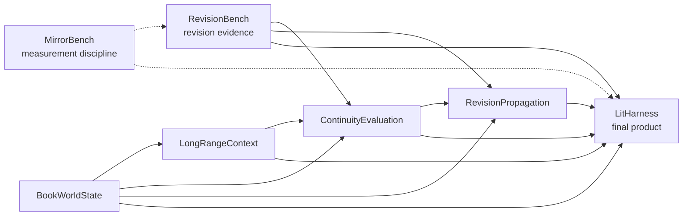

# LitHarness: Product and Research Integration Plan

> **⚠️ SUPERSEDED — archived, do not act on this document.**
> Replaced by [PLAN.md](PLAN.md) (v2.2) on 2026-08-12. This is v1: a human-in-the-loop
> *authoring tool*, whose central premise PLAN.md §0 explicitly rejects in favour of an
> autonomous system with a human director. It is kept for the record of what changed and
> why. Everything below describes a design that was not built.

**Status:** SUPERSEDED by PLAN.md v2.2; kept as an archived record  
**Role:** Production-grade AI book-writing harness assembled from validated research incubators  
**Inspection baseline:** Local projects inspected and tests run on 2026-08-12

## 1. Executive summary

LitHarness is the final authoring product. Its sibling projects are research incubators: they should be allowed to test competing representations, prompts, algorithms, and benchmarks without forcing experimental choices into the product. Validated pieces are promoted into versioned libraries or services behind stable contracts.

The product loop is:

```text
plan
  -> assemble evidence-backed context
  -> generate a bounded manuscript change
  -> extract proposed state changes
  -> review/accept state
  -> evaluate continuity and manuscript effects
  -> plan downstream propagation
  -> human approval
  -> apply, verify, and version
```

The architectural principle supported most directly by existing evidence is **detect → scoped repair → verify**, not open-ended “improve this” revision. RevisionBench measured that bounded editing can preserve more of the source but still makes many irrelevant edits when the model itself chooses what to change. Its mechanical detector greatly improved aim, and its synthetic cross-chapter experiment showed high precision/recall when state is explicit. LitHarness should therefore make unchanged text structurally ineligible for revision unless a located complaint or explicit author request licenses it.

BookWorldState supplies the strongest current implementation candidate: a model-independent, temporal, provenance-aware domain core already exists and passes its tests. LongRangeContext, ContinuityEvaluation, and RevisionPropagation begin as plans in this work and must earn promotion through their own benchmarks. MirrorBench should inform measurement, provenance, and trust boundaries; it is not a required runtime dependency.

## 2. Product goals

- Help an author plan, draft, inspect, revise, and export a book without losing control of text or intent.
- Maintain stable, versioned manuscript identity from book to span across reordering and edits.
- Bring the right local and distant context to each generation while preventing branch, time, and POV leaks.
- Maintain objective canon, character beliefs/knowledge, uncertainty, plans, and evidence as distinct concepts.
- Detect located continuity and evaluation concerns before inviting changes.
- Restrict proposed repairs to explicit scope and verify that they solve the cited problem without new damage.
- Trace every generated claim, finding, revision, and derived artifact to exact inputs and tool/model versions.
- Make all consequential changes reviewable, reversible, reproducible, and recoverable.
- Work with multiple model providers, local models, or no model for deterministic operations.
- Scale to ordinary novel-length manuscripts with predictable latency and cost.

## 3. Non-goals

- Fully autonomous publication or unattended whole-book rewriting.
- A promise that generated prose is objectively “better.”
- One universal style, structure, genre ontology, or pacing formula.
- A single foundation-model/provider commitment.
- Using model self-confidence or self-reported success as proof of correctness.
- Making experimental mechanistic-interpretability machinery part of the production request path.
- Replacing professional developmental editing, legal review, fact checking, sensitivity reading, or human authorship decisions.
- Supporting real-time multi-author collaboration, marketplace/community features, or every export format in the first production release.

## 4. Target author workflows

### 4.1 Start and plan a book

Create a book, premise, optional structure, characters, world rules, and author constraints. Plans may be detailed or sparse. The author can lock any statement and can distinguish “intended,” “possible,” and “canonical in prose.”

### 4.2 Draft a scene

Choose or create a scene plan. LitHarness assembles a context packet, shows its critical constraints and omissions, generates into a new candidate version, then lets the author accept, edit, or reject. Acceptance triggers state extraction and evaluation; it does not silently canonize model-extracted facts.

### 4.3 Continue existing prose

Use exact local text plus relevant distant context. Preserve the preceding text byte-for-byte. Record exactly which sources the continuation consumed.

### 4.4 Inspect continuity

Run deterministic checks incrementally and optional model critics on demand or at milestones. Findings show the manifestation span, supporting evidence, confidence, severity, and why the issue may matter. Authors can confirm, dismiss as intentional, defer, or request a repair.

### 4.5 Repair one issue

Build a diff-aware packet for a confirmed finding. Produce a bounded patch, show before/after and preservation checks, and accept only with author approval. Re-run the cited detector plus relevant regression checks.

### 4.6 Change an early fact or plan

Preview a propagation report before modifying other artifacts. Derived summaries/indexes can update automatically; prose and intent-bearing plans require scoped approval. The author can accept some steps, reject others, or keep intentional inconsistencies.

### 4.7 Explore alternate versions

Fork a branch from any manuscript revision. Context, state, findings, and dependencies remain branch-scoped. Compare or selectively merge changes through explicit plans.

### 4.8 Export and reproduce

Export a frozen revision to Markdown and DOCX first, EPUB later. The export manifest records the exact manuscript revision, settings, and assets. Re-exporting the same inputs produces equivalent output.

## 5. Architecture at a glance

```text
Author UI / Editor
        |
Application commands + queries
        |
Manuscript IR & version store ---- Event log / jobs / outbox
   |          |          |                    |
 Planning  World State  Dependency Graph     Observability
   |          |          |
   +------ Context Assembly ------+
                  |               |
             Generation       Evaluation
                  |               |
          Candidate patch   Structured findings
                  \              /
              Revision planner
                     |
              Approval + verify
                     |
              New immutable revision
```

Subsystems communicate through versioned contracts and immutable artifact references. The application layer owns transactions and workflow state; model adapters remain at the edge.

## 6. Research dependency and integration graph



Research independence:

- MirrorBench and RevisionBench can continue independently of product work.
- BookWorldState can harden independently against its own contracts and benchmarks.
- LongRangeContext can benchmark prose, plan, and mock-state sources before BookWorldState integration.
- ContinuityEvaluation can begin with frozen context/state fixtures.
- RevisionPropagation can begin with synthetic exact graphs before inferred edges or live subsystem integration.
- LitHarness should integrate only versioned, gate-passing slices, never wait for every research question to finish.

## 7. Inspected project state and promotion map

The following is based on local files, repository history/status, saved results, and test runs on 2026-08-12. Documentation labels that lag implementation are noted rather than repeated as current truth.

### 7.1 RevisionBench — revision-loop measurement and safe-repair evidence

**Responsibility**

Measure what repeated model revision does to prose and compare revision architectures using stylometry, slop, thrash, planted-defect outcomes, judge protocols, and cross-chapter consistency experiments.

**Current progress**

- Clean Git worktree with active commits through 2026-08-12.
- `390 passed` locally during this inspection.
- Phase 0 is complete despite the README still saying “Phase 0 in progress.” It has a reproducible corpus, provenance, stylometry/slop/thrash instruments, local-model loop runner, and saved curves/results.
- Phase 1 M1-a/M1-b are complete. Bounded edit-list arms control length and reduce destructive change, but measured aim remains poor: A2i applied 195 edits for 8 planted defects; A2f applied 529 for 14.
- Phase 2 M2-a/M2-b are complete. Raw model-judge verdicts showed severe position effects; order-consistent verdicts retained only 35–57% and favored originals roughly 80% of the time. Human calibration remains critical.
- A deterministic detector over the literary defect set reported 61% of complaints on planted defects, versus 2.6% of A2f edits, though injector/detector co-design makes recall an upper bound.
- A synthetic LitRPG stratum now exercises cross-chapter state: 20 manuscripts × 16 chapters, 153 planted contradictions, 99% recall and 88% precision, including 100% recall over 76 genuinely cross-chapter defects. This uses templated prose and fixed status schemas, so it is an achievable upper bound, not a real-manuscript estimate.
- Code includes bounded edit application, detector/injector machinery, local Ollama adapter, strict configs, crash-safe records/resume, provenance, metrics, judge utilities, and saved result surfaces.

**Reusable flow into LitHarness**

- Detect → scoped repair → verify product policy.
- Located complaint eligibility and bounded edit representation.
- Mechanical vetoes for length, slop, punctuation/style movement, defect resolution, and unintended deletion.
- Corpus/provenance/run-record patterns and adversarial regression cases.
- Stylometry, thrash, edit-volume, removal-aware recall, overreach, order-consistency, and blinding-audit instruments.
- LitRPG state-machine corpus concepts for deterministic end-to-end tests.

**Missing work**

- Build and evaluate the actual detect-then-repair arm (A2d/A3d), including “complaint resolves and no new complaint appears.”
- Run model-written chapters and status-schema variation; current cross-chapter results depend on templated prose and easy parsing.
- Human judge calibration, larger/second-family replication, and stronger uncertainty intervals.
- Separate reusable library contracts from benchmark-specific code.
- Add a stable document/span model or adapt to LitHarness IR; RevisionBench passages are not a product manuscript model.
- Clarify licensing/data promotion and remove stale status documentation before a release tag.

**Integration readiness criteria**

- Promote metrics/diff/record components only after API extraction and contract tests.
- Promote a repair policy only after detect-then-repair beats revise-then-gate on affected-span precision, preservation, and defect recall in held-out manuscripts.
- Treat thresholds as benchmark/profile data, not product constants.

### 7.2 MirrorBench — measurement discipline and model-report trust boundary

**Responsibility**

Measure report–state agreement in an open-weight model using activation interventions, J-lens readouts, probes, and paired behavioral protocols. It is not a book subsystem.

**Current progress**

- Clean Git worktree with commits through 2026-08-11.
- `1316 passed, 1 skipped` locally during this inspection; CPU/offline test discipline and CI are documented.
- M0–M4 are complete with committed result artifacts: rig validation, injection detection, denial gap, concept identification, and steering awareness.
- M5’s fact/readout instrument exists: 96 authored facts, with valid readout layers empirically identified, but the continual-learning perturbation experiment itself has not started.
- M5 continuation, M6 grounded self-report, and M7 aggregation/publication are unfinished.
- Results are intentionally narrow: one main model/lens/direction source; several null/negative findings; some early result rows came from a dirty worktree; bootstrap work remains.

**Reusable flow into LitHarness**

- Research governance: frozen configs, exact model/lens identities, full result surfaces, explicit exclusions, confound gates, and “no ambiguous PASS.”
- Paired/control design, strict parsing, per-trial provenance, idempotent resume, and adversarial review patterns.
- Evidence that a model saying it noticed, succeeded, or improved something is not a correctness signal. Product actions require external evidence or human approval.
- Warnings about position bias, output-format contamination, runtime drift, and plausible wrong numbers.

**Missing work**

- Remaining benchmark milestones and broader model/lens replication.
- Clean canonical reruns for artifacts recorded from dirty trees and stronger by-concept intervals.
- A documented extraction of generic provenance/runner utilities if code reuse is desired.

**Integration readiness criteria**

- No MirrorBench activation/lens runtime is required for LitHarness alpha or production.
- Adopt its methodological invariants immediately; reuse code only if separated from model-specific GPU dependencies and shown simpler than implementing the small generic contracts in LitHarness.
- Any future mechanistic signal remains diagnostic until it demonstrates incremental value on book tasks.

### 7.3 BookWorldState — temporal, provenance-aware canonical state

**Responsibility**

Maintain entities, assertions, events, relationships, threads, character knowledge/belief, story time, evidence, branches, state projections, contradictions, and invalidation without depending on a model provider.

**Current progress**

- Moved well beyond its PLAN’s “proposed” label into an executable `0.1.0` vertical-slice foundation.
- `65 passed` locally during this inspection.
- Implemented immutable branch-scoped domain records; interval/event-relative time; exact evidence spans; a closed predicate registry for core state; candidate review; optimistic concurrency/idempotency; in-memory and SQLite adapters; bitemporal history; identity resolution; provider-independent extraction boundary; deterministic continuity findings; POV-aware context packing; dependency invalidation; and a six-scene golden scenario.
- Its evaluation report records 100% critical context/guardrail/evidence outcomes on that golden scenario, incremental parity there, focused SQLite reads around 12 ms at 5k active records and 53 ms at 20k, and a passing interactive workload gate.
- Its disposable pattern extractor performed poorly—33% precision and 50% recall on a small adversarial corpus—and is explicitly review-only.
- Important repository readiness caveat: the Git repository has no commits and all implementation files are untracked. The package currently declares a proprietary license. These block trustworthy promotion even though code/tests exist.

**Reusable flow into LitHarness**

- Domain model and value objects for branch, story time, provenance, assertions, candidates, epistemics, relationships, events, and threads.
- Repository contracts and in-memory/SQLite reference adapters.
- Candidate acceptance/rejection, optimistic concurrency, idempotency, replay, projections, and stable invalidation semantics.
- Context/state query concepts and six-scene golden integration scenario.
- Architecture decisions, predicate registry, benchmark harness, and adapter parity tests.

**Missing work**

- Commit and tag a clean baseline; resolve ownership/license for integration.
- World-rule records and constrained expressions.
- Realistic, held-out human-authored extraction/evaluation corpus and useful extractor(s).
- Entity merge/split and evidence span re-anchoring.
- Atomic context-packet persistence plus dependency registration.
- Stable service/API adapter and transactional outbox/domain-event publication.
- Concurrent-writer, security, backup/restore, recovery, long-history, production-database, and load evidence.
- Human-review usability and downstream writing-value trials.

**Integration readiness criteria**

- First candidate for an alpha library once committed, licensed, versioned, and exposed through frozen contract tests.
- Automatic extraction must remain proposed/reviewed data; no silent canonization.
- SQLite may serve local alpha but remains a reference choice until durability/concurrency/recovery gates pass.

### 7.4 LongRangeContext — context assembly research

**Responsibility**

Retrieve, rank, compress, pack, trace, cache, and invalidate book-scale context under fixed budgets.

**Current progress**

- Folder and rigorous PLAN created in this work.
- Plan-only: no repository scaffold, code, corpus, experiments, or results yet.

**Expected reusable flow**

- ContextQuery, ContextItem, ContextPacket, token-budget, and consumed-source schemas.
- Retrieval/ranking/summary/compression strategies with benchmark results.
- Context caches and invalidation contracts.
- Synthetic and human-authored context-quality corpora, metrics, and compatibility tests.

**Missing work**

- Entire M0–M5 implementation and evidence program described in its PLAN.

**Integration readiness criteria**

- Beat recent-window and naive vector baselines at equal token budgets on held-out books.
- Meet critical recall, forbidden/stale-context, provenance, rebuild-parity, latency, and reproducibility gates.
- Provider-specific ranking/compression stays behind ports.

### 7.5 ContinuityEvaluation — findings and evaluator research

**Responsibility**

Produce located, typed, evidence-backed continuity and manuscript-evaluation findings using deterministic checks and calibrated model critics.

**Current progress**

- Folder and rigorous PLAN created in this work.
- Plan-only: no repository scaffold, code, corpus, experiments, or results yet.
- It can bootstrap from BookWorldState’s current deterministic continuity concepts and RevisionBench’s detectors/corpora, but those are sources, not evidence that this new subsystem already works.

**Expected reusable flow**

- Finding/EvaluationPlan/EvaluationArtifact schemas.
- Deterministic detector pack; optional calibrated critic adapters and ensemble policies.
- Gold-label, adversarial, and revision regression corpora.
- Calibration, evidence-resolution, false-positive, and review-workload results.

**Missing work**

- Entire M0–M5 program, including independent annotations, human calibration, long-range integration, and category-specific gates.

**Integration readiness criteria**

- Deterministic categories meet high-precision and critical-recall gates on held-out books.
- Model critics demonstrate incremental value, resolved evidence, abstention, and calibrated thresholds.
- Incremental evaluation matches clean runs and findings have stable IDs/status transitions.

### 7.6 RevisionPropagation — edit impact and orchestration research

**Responsibility**

Build versioned dependency graphs, classify changes, find affected nodes, invalidate/recompute derived artifacts, and create explainable human-approved revision plans.

**Current progress**

- Folder and rigorous PLAN created in this work.
- Plan-only: no repository scaffold, graph, benchmark, executor, or results yet.
- BookWorldState contains a smaller implemented invalidation/impact slice, but the cross-artifact propagation product described here remains unbuilt.

**Expected reusable flow**

- Node/edge/change/impact/revision-plan/event schemas.
- Versioned graph and deterministic invalidation core.
- Diff-aware preservation policies, idempotent plan execution, rollback/recovery behavior.
- Exact synthetic graph generator and authored impact benchmarks.

**Missing work**

- Entire M0–M5 program, especially cross-project graph contracts, inferred-edge calibration, approval workflow, compound rollback, and scale tests.

**Integration readiness criteria**

- Full recall for deterministic derived invalidation and critical golden impacts.
- Acceptable warning precision and zero unsafe-preserve-node mutation.
- Incremental/clean parity, idempotent recovery, stale-approval rejection, and branch isolation.

## 8. Ownership boundaries and overlap

| Concern | Owner | Consumers / notes |
|---|---|---|
| Ordered manuscript content and stable text identity | LitHarness manuscript core | All subsystems reference it; none owns prose storage independently |
| Plans and author intent | LitHarness planning core | State/context/evaluation/propagation read versioned plans |
| Canon, events, epistemics, world rules | BookWorldState | Context and evaluation query through ports |
| Context retrieval, ranking, summary, packing | LongRangeContext | Generation/evaluation/repair consume frozen packets |
| Findings, detector/critic calibration | ContinuityEvaluation | RevisionPropagation consumes finding dependencies |
| Dependency graph, impact, invalidation orchestration | RevisionPropagation | Algorithms remain distinct from each subsystem’s local cache implementation |
| Revision-policy evidence and metrics | RevisionBench | Research source; promoted utilities only |
| Model report–state research | MirrorBench | Methodological/optional diagnostic input, never production authority |
| Generation, model routing, jobs | LitHarness generation platform | Providers are adapters |
| Approval, editor UX, workflow state | LitHarness UI/application | Research repos do not decide mutations |
| Persistence transaction boundary and event publication | LitHarness platform | Subsystems offer repositories/ports; product coordinates commits |
| Export/rendering | LitHarness export | Frozen manuscript revision only |

### Overlap resolutions

- BookWorldState currently has POV-aware context packing. Keep its **state selection/query** logic, but LongRangeContext owns whole-packet ranking and budgeting across prose, plans, summaries, and state.
- BookWorldState currently has deterministic continuity findings. Keep state-local invariants close to the domain; ContinuityEvaluation adapts and aggregates them into the common finding model alongside other detectors.
- BookWorldState has record invalidation. Each subsystem may mark its own derived records stale; RevisionPropagation owns cross-subsystem graph traversal, revision planning, and scheduling.
- RevisionBench detectors remain benchmark/reference implementations. ContinuityEvaluation owns production detector interfaces and calibration.
- RevisionBench edit-list application can seed bounded-patch work, but LitHarness manuscript core owns canonical patch validation and application.
- Provenance/runner patterns appear in both benchmark repos. Define one small LitHarness artifact/run contract rather than importing either research runner wholesale.

## 9. Manuscript IR and state architecture

### 9.1 Manuscript IR

Use a typed, ordered tree:

```text
Book -> Part/Act? -> Chapter -> Scene -> Block -> TextSpan
```

Core records:

- stable logical ID;
- immutable version ID and parent revision;
- branch ID;
- ordered position using a reorder-friendly key;
- content plus content hash;
- structural kind and metadata;
- source/import provenance;
- lock/preservation policy;
- optional plan/state links;
- tombstone/supersession rather than destructive deletion.

The IR must support scene/chapter reorder, split/merge, stable references across ordinary edits, and explicit failure when an evidence span cannot be re-anchored. Exact text and structured metadata are stored separately; generated Markdown is not the database of record.

### 9.2 State layers

Keep distinct:

- **manuscript truth:** what current accepted prose says;
- **author canon:** explicit author-locked assertions and rules;
- **plans:** intended future content, not yet canon;
- **objective story state:** accepted assertions/events;
- **perspective state:** character knowledge, belief, suspicion, and reports;
- **derived artifacts:** summaries, embeddings, inferred edges, findings;
- **proposals:** generated prose, extracted facts, suggested updates, repairs.

No proposal becomes accepted prose or canon merely because a model returned it.

### 9.3 Revision identity

A product revision is an immutable manifest referencing versions of manuscript, plans, state acceptance transaction, graph, and configuration. Not every derived cache requires a new author-visible revision, but every artifact records the revision it represents.

## 10. End-to-end generation and revision loop

### Step 1 — Plan

The author creates/selects book, chapter, and scene intentions. Planning can be optional, but absence is explicit. Locked constraints and open questions are first-class.

### Step 2 — Assemble context

LongRangeContext receives a typed operation and frozen revision. It gathers local prose, plans, author rules, state/knowledge, open threads, distant evidence, and summaries; enforces hard filters; packs to budget; and persists the packet plus consumed-source ledger.

### Step 3 — Generate a candidate

Generation runs through a provider abstraction with a frozen model profile, template, tools, seed where supported, and budget. Output is a candidate artifact, never an in-place mutation. Continuation, scene draft, and repair use different output schemas and validation.

### Step 4 — Validate shape and scope

Check parseability, allowed target span/node, length/structure limits, locked content, unauthorized deletion, and provider/tool errors. A failed candidate is recorded and does not advance state.

### Step 5 — Extract proposed state updates

Run provider-independent extraction adapters against the candidate and relevant prior state. Normalize into typed candidates with evidence. Deterministic rules validate shape; author or policy reviews acceptance. BookWorldState remains authoritative for state semantics.

### Step 6 — Evaluate

ContinuityEvaluation runs deterministic checks and requested critics over frozen state/context. Findings link to exact candidate/manuscript spans and supporting records. For repair, rerun the cited finding first, then scoped regression checks.

### Step 7 — Analyze propagation

RevisionPropagation compares before/after, updates dependency proposals, identifies stale artifacts and possible downstream effects, and returns a dry-run plan. Derived artifacts may be scheduled automatically; prose and plans remain approval-bound.

### Step 8 — Approve and commit

The author reviews candidate diff, state updates, findings, and propagation plan. The application commits accepted changes with optimistic concurrency and emits an outbox event. Approval expires if base versions changed.

### Step 9 — Recompute and verify

Jobs recompute summaries, contexts, evaluations, graph projections, and exports in dependency order. Failures remain retryable and visible. High-risk releases periodically compare incremental results with clean rebuilds.

## 11. Cross-project contracts

Freeze contracts in a neutral `litharness-contracts` package (or language-neutral JSON Schema/OpenAPI definitions) before parallel implementation.

### Required IDs and references

```yaml
resource_ref:
  project_id: uuid
  book_id: uuid
  branch_id: uuid
  logical_id: uuid
  version_id: uuid
  kind: manuscript_scene | plan | assertion | event | summary | finding | graph_node

evidence_span:
  source: resource_ref
  start: 0
  end: 42
  content_sha256: hex
  anchor_before: optional text
  anchor_after: optional text
```

### Core artifact envelopes

- `ManuscriptRevision`
- `PlanSnapshot`
- `StateSnapshot` and `StateCandidateBatch`
- `ContextQuery` and `ContextPacket`
- `GenerationRequest`, `GenerationCandidate`, and `BoundedPatch`
- `EvaluationPlan`, `Finding`, and `EvaluationArtifact`
- `ChangeSet`, `ImpactReport`, and `RevisionPlan`
- `RunManifest`, `JobRecord`, and `ExportManifest`

Every envelope includes schema version, artifact ID, source revision(s), created time, actor/tool, configuration digest, causal/correlation IDs, warnings, and dependency refs.

### Compatibility rules

- additive fields are optional within a major schema version;
- consumers reject unknown major versions rather than guessing;
- enum additions require an `unknown` handling test;
- exact source hashes are mandatory for span evidence;
- model identifiers include provider, model/version or digest where available, request profile, and template version;
- wall-clock timestamps do not determine narrative order;
- all write commands carry idempotency keys and expected base versions.

## 12. Plugin and provider abstraction

### Provider interfaces

- text generation/structured output;
- embeddings;
- reranking;
- extraction;
- critic/evaluator;
- token counting/capability discovery;
- optional tool execution.

Domain and application code must not import provider SDKs. An adapter declares capabilities, context limit, tokenizer identity, structured-output support, streaming semantics, retry safety, privacy mode, pricing unit, and version observability.

### Plugin interfaces

Plugins may add:

- genre-specific planners and schemas;
- detectors/critics;
- world-state predicates and renderers through reviewed registries;
- import/export formats;
- model/provider adapters;
- context retrievers and ranking profiles;
- UI panels that consume public read models.

Plugins run with explicit permissions and versioned manifests. They cannot mutate canonical prose/state except through application commands and approval policy. Plugin failures are isolated and their artifacts identify plugin version.

## 13. Persistence and events

### 13.1 Storage approach

Start unified and modular:

- relational database for projects, hierarchy, versions, jobs, approvals, events, state records, dependencies, and artifact metadata;
- object/blob storage for large prompt/response artifacts, rendered exports, snapshots, and benchmark payloads;
- full-text index for lexical retrieval;
- vector index as an optional derived projection;
- append-only event/outbox log for reliable cross-subsystem work.

SQLite is acceptable for a single-user local alpha, informed by BookWorldState’s measured focused projections. Production deployment must choose storage after concurrency, backup/restore, and recovery tests; the domain contracts must not depend on SQLite-specific behavior.

### 13.2 Transaction boundary

An accepted edit, its new manuscript revision, approval record, initial state candidates, dependency/source ledger, and outbox event should commit atomically where possible. Model calls occur outside the database transaction. Long tasks use durable jobs and publish artifacts only after validation.

### 13.3 Event architecture

Events include schema version, event ID, idempotency key, project/book/branch/revision, actor, causation/correlation IDs, and payload digest. Consumers are idempotent. Delivery is at-least-once; handlers must tolerate replay and out-of-order arrival using expected versions.

Core events:

```text
PlanChanged
ManuscriptCandidateCreated
ManuscriptRevisionAccepted
StateCandidatesExtracted
StateRecordsAccepted
ContextPacketCreated
EvaluationCompleted
FindingStatusChanged
ImpactAnalyzed
RevisionPlanApproved
ArtifactInvalidated
ArtifactRecomputed
ExportCreated
JobFailed
```

## 14. UI and editor responsibilities

The UI owns clarity and consent, not hidden domain policy. It should provide:

- manuscript tree and focused editor with stable revision/diff display;
- scene/chapter/book planning views;
- visible “why this context” panel, critical constraints, omissions, and source navigation;
- stream preview that remains a candidate until complete/validated;
- structured world-state, timeline, character knowledge, threads, and evidence review;
- findings inbox grouped by severity/category with high-precision and exploratory lanes;
- propagation graph/path explanation translated into an actionable step list;
- per-step approve/reject/edit, bulk approval only for safe derived actions;
- locks and preservation constraints;
- branch/version history, compare, restore, and rollback;
- job progress, errors, retry, and partial-result visibility;
- model/cost/privacy profile controls at an understandable level;
- export preview and frozen revision selection.

The editor must never display model streaming text as already committed. It must reveal stale or incomplete context/evaluation status when it affects a decision.

## 15. Observability and debugging

Each user action receives a correlation ID linking:

- command/query;
- manuscript/state/plan/graph versions;
- context query, candidates, scores, packed packet, exclusions, and token counts;
- model request metadata, streamed chunks, parse/validation outcome, latency, retries, and usage;
- extraction candidates and acceptance decisions;
- findings and evidence;
- impact paths, revision plan, approvals, and execution;
- emitted events, job attempts, cache/invalidation operations, and export.

Provide an author-safe explanation view and a developer trace view. Redact secrets and optionally manuscript content in centralized telemetry. Support local-only logs. Metrics include success/error/abstention, latency percentiles, queue age, cost/tokens, cache hits, stale artifacts, finding acceptance/dismissal, rewrite surface, rollback, and provider degradation.

Debug artifacts are immutable and exportable as a reproducibility bundle subject to privacy settings.

## 16. Reproducibility

Every model-involved run records:

- exact input artifact IDs/hashes and rendered request;
- model provider/name/version/digest where observable;
- adapter and runtime versions;
- template/system instruction versions;
- sampling parameters and seed where supported;
- tool/plugin versions and outputs;
- tokenizer and token counts;
- configuration hash, code/build version, timestamps, and platform profile;
- raw output, parser version, exclusions, retries, and final validated artifact.

Reproducibility has levels:

1. **Exact deterministic replay** for rules, persistence projections, patches, and exports.
2. **Artifact replay** for model work: rescore/reparse saved output without recalling the provider.
3. **Request replay** with the same provider/profile, explicitly not assumed byte-identical.
4. **Semantic regression** where exact output cannot be guaranteed.

Production claims must identify which level applies.

## 17. Benchmarks and promotion gates

Research code cannot enter the critical product path because it exists or has many tests. Promotion requires:

1. a clearly owned product capability and stable contract;
2. frozen training/calibration/test splits by manuscript;
3. simple baselines and full-surface results;
4. held-out performance meeting category-specific gates;
5. failure/adversarial tests and explicit exclusions;
6. source/model/data licensing and privacy review;
7. deterministic/offline contract tests where possible;
8. performance, cost, recovery, and migration evidence;
9. documented limitations and rollback/removal plan;
10. shadow/canary period before automatic product authority.

### Initial cross-system gates

- No loss/corruption under crash, retry, concurrency, migration, export, and rollback tests.
- 100% preservation of untouched spans for bounded repairs.
- Zero automatic prose/canon mutation without configured authorization.
- 100% critical deterministic state/context/impact recall in golden scenarios.
- Zero branch, POV, and acknowledged-stale-context leaks in deterministic suites.
- Incremental and clean rebuild semantic parity on all golden revisions.
- Every production finding and generated change has resolvable provenance.
- No model critic becomes a blocking gate until calibrated against human labels for that task.
- Product latency/cost budgets are met at 100k words with graceful behavior at 250k.

Thresholds for research metrics live in versioned evaluation profiles and may tighten as evidence improves.

## 18. Testing strategy

### Unit and property tests

Test domain invariants, time intervals, ID/version semantics, patch bounds, ranking/budget math, finding normalization, graph traversal, event idempotency, and export escaping. Property-test edit/reorder/branch histories and graph/invalidation parity.

### Contract tests

Each promoted subsystem adapter runs a shared compatibility suite against frozen fixtures. Test schema evolution, unknown enum values, exact evidence hashes, idempotent commands, expected-version conflicts, and error/abstention paths.

### Integration tests

Use provider fakes and saved outputs to exercise planning → context → generation → extraction → evaluation → propagation → approval → commit. Real provider tests are separately marked, budgeted, and never required for offline CI.

### Golden books

Maintain:

- six-scene mystery for state/knowledge/revision basics;
- 12-scene adversarial novella for context and continuity;
- 20×16-chapter state-machine/LitRPG corpus for scaleable exact defects;
- multi-branch revision history with rename, reveal move, scene reorder, and rollback;
- human-authored held-out manuscripts across genres.

### Adversarial and metamorphic tests

- reorder irrelevant chapters: relevant results should remain stable;
- paraphrase evidence without changing fact: state/impact should remain equivalent;
- change typography only: semantic propagation must not expand;
- swap judge pair order: preference should remain text-consistent or abstain;
- inject stale cache, missing events, duplicate delivery, partial provider output, corrupt hashes, ambiguous identities, and branch leakage;
- compare incremental state/context/findings/graph/export with clean rebuild.

### Human evaluation

Measure author task success, review time, acceptance/dismissal, trust calibration, error detection, voice preservation, and ability to undo. Blinding itself is tested for surface leakage. Human labels never share the same manuscript across calibration and final test.

## 19. Failure recovery

- Model calls write provisional artifacts and can resume or retry with idempotency keys.
- Streaming candidates are not publishable until completion and validation.
- Provider timeouts, refusals, malformed output, and rate limits are explicit job outcomes.
- If extraction fails, prose can remain a candidate or be accepted with state marked pending; the UI must show the consequence.
- If evaluation fails, no false clean bill of health is emitted.
- If propagation fails, accepted source revision remains durable and dependent artifacts stay visibly stale until recomputed.
- Outbox/event retries cannot duplicate state changes.
- Checkpoints protect long jobs; poison jobs move to a review queue.
- Backup/restore tests cover database, blob artifacts, encryption keys/config, and exported manifests.
- Disaster recovery verifies a restored system can rebuild all derived indexes from canonical records and events.

## 20. Versioning and migrations

- Semantic version every public contract and promoted package.
- Store schema version on every long-lived artifact/event.
- Use expand/migrate/contract database changes; support mixed-version workers during rollout where necessary.
- Keep read adapters for old artifact versions until migration is verified.
- Migrations are restartable, checksummed, backed up, and tested against realistic histories.
- Model/prompt/policy upgrades create new profiles; old revisions retain their original manifests.
- Changing a detector or context algorithm marks relevant derived artifacts outdated but does not rewrite canonical prose.
- Product rollback must include application, schema compatibility, job workers, and plugin versions.

## 21. Export

Initial formats:

- canonical Markdown bundle with manuscript hierarchy and optional metadata sidecars;
- DOCX with chapter/scene styles and author-selectable front/back matter;
- plain text for portability.

EPUB follows after navigation, metadata, images, footnotes/endnotes, and validation are mature. Every export uses a frozen accepted revision and creates an `ExportManifest` with renderer/version/settings/input hashes/output hashes/warnings. Export tests cover ordering, typography, Unicode, scene breaks, headings, notes, images, and round-trip comparison where meaningful.

Never overwrite a published export silently; create a new version and preserve its manifest.

## 22. Performance and cost

### Budgets to establish in alpha

- editor save/commit p95 below 150 ms for local operations;
- focused state/context read p95 below 500 ms at 100k words;
- deterministic incremental evaluation/impact preview p95 below 2 seconds for ordinary scene edits;
- UI acknowledgement of long jobs below 100 ms, with progressive status;
- no O(book-size) synchronous work on the keystroke or commit path;
- configurable generation token/cost ceiling per operation and per project/day;
- cache effectiveness and recomputation fan-out reported, not merely optimized.

### Cost controls

- deterministic detection before model critics;
- retrieve then compress, never repeatedly summarize the whole book;
- content-addressed caching with correct invalidation;
- small/cheap models for structured extraction only after accuracy gates;
- batch/background evaluation and author-selectable depth;
- preflight estimated tokens/cost and hard budget enforcement;
- circuit breakers and fallback profiles;
- store artifacts so parsing/scoring experiments do not recall models.

Performance gates must include cold and warm paths, 50k/100k/250k manuscripts, long revision histories, branch counts, concurrent jobs, and provider degradation.

## 23. Migration from research repos

Do not merge repositories wholesale. Use this promotion sequence:

1. Identify a capability and its minimal public contract.
2. Freeze benchmark fixtures and reproduce the claimed result from a clean commit.
3. Resolve license/ownership and dependency/security inventory.
4. Extract or reimplement the smallest coherent module with its tests and provenance.
5. Publish a versioned package or service adapter.
6. Run the LitHarness compatibility suite and end-to-end golden book.
7. Shadow the product baseline and compare correctness, utility, latency, and cost.
8. Canary behind a feature flag with per-project opt-in.
9. Promote, retain rollback, and deprecate duplicate experimental code deliberately.

Likely packaging:

- `litharness-contracts`: neutral schemas/IDs/artifact envelopes;
- `litharness-manuscript`: IR, versions, bounded patches;
- `book-world-state`: promoted external/internal library behind port;
- `long-range-context`: promoted library/service behind assembler port;
- `continuity-evaluation`: detector/runner package behind evaluator port;
- `revision-propagation`: graph/impact/planner package behind propagation port;
- `litharness-models`: provider adapters and profiles;
- `litharness-app`: transactions, jobs, policy, events;
- `litharness-ui` and `litharness-export`.

Research repos retain exploratory notebooks/configs/results and continue to validate future candidates. Product packages receive their own release cadence and support policy.

## 24. Staged roadmap

Durations should be set after staffing and M0 sizing; gates, not dates, control promotion.

### Stage 0 — Foundation and contracts

- Freeze vocabulary, IDs, source spans, artifact envelopes, events, and approval rules.
- Commit/license/tag BookWorldState baseline.
- Scaffold LitHarness core with manuscript IR, immutable revisions, local persistence, job/outbox foundation, and provider fake.
- Create cross-project golden story and compatibility fixtures.

**Exit:** manuscript revisions, evidence refs, candidate patches, events, and restore work end-to-end without a model.

### Stage 1 — First safe vertical slice

Workflow: plan one scene → assemble deterministic local/state context → generate candidate → review state candidates → deterministic evaluation → accept/reject → export Markdown.

- Integrate BookWorldState through a port.
- Use a simple transparent context baseline, not the unfinished advanced research stack.
- Add exact diff, locks, provenance, local model/provider adapter, and candidate review.

**Exit:** six-scene golden book and manual author trial complete with no silent mutation or stale-state leak.

### Stage 2 — Detection and scoped repair

Workflow: detect one located continuity issue → request bounded repair → verify complaint and preservation → approve → recompute.

- Promote validated RevisionBench metrics/application ideas.
- Integrate early deterministic ContinuityEvaluation slice.
- Keep propagation to direct derived artifacts and explicit edges.

**Exit:** detect-then-repair beats revise-then-gate baseline on held-out affected-span precision and preservation.

### Stage 3 — Long-range alpha

Workflow: draft/evaluate a distant callback in a 50k–100k word book.

- Integrate gate-passing LongRangeContext retrieval/packing.
- Add scene/chapter summaries, consumed-source ledger, cache invalidation, book-level findings.
- Add human-facing context inspection and omission warnings.

**Exit:** held-out context utility, critical recall, stale/leak, latency, and cost gates pass.

### Stage 4 — Revision propagation alpha

Workflow: change an early fact → preview affected plans/state/prose/findings → approve selected repairs → rollback.

- Integrate deterministic graph/invalidation core first; inferred edges stay advisory.
- Add branches, compound revision plans, approval expiration, clean-rebuild parity, and recovery tests.

**Exit:** critical affected-node recall, unnecessary rewrite, parity, rollback, and branch-isolation gates pass.

### Stage 5 — Unified author alpha

- Cohesive editor, plan/state/finding/propagation views.
- Markdown/DOCX export, local backup/restore, project privacy controls.
- Real 50k–100k manuscript trials across several genres.
- Observability bundles and support diagnostics.

**Exit:** authors can complete the target workflows; severe data-integrity and consent bugs are zero; known limitations are visible.

### Stage 6 — Beta

- Production persistence decision and migration.
- Concurrency, security, plugin sandbox/permissions, provider fallbacks, cost controls, accessibility, upgrade/rollback, larger corpus trials.
- Calibrated optional critics and cross-project regression dashboard.

**Exit:** SLOs, recovery objectives, security review, migrations, support playbooks, and beta user-value gates pass.

### Stage 7 — Production

- Stable contracts and deprecation policy.
- Monitored staged rollout, backup/restore drills, incident response, privacy/data export/deletion, release reproducibility, and supported export pipeline.
- No research subsystem receives automatic authority without its promotion gate and canary evidence.

## 25. Integration order and vertical slices

Recommended order:

1. Manuscript IR, versions, bounded patch, evidence span, events, jobs.
2. BookWorldState deterministic core after repository/license baseline.
3. Simple context baseline sufficient for first scene generation.
4. Deterministic continuity findings.
5. RevisionBench-derived scoped repair and preservation metrics.
6. LongRangeContext algorithms after benchmark gates.
7. RevisionPropagation deterministic graph/invalidation.
8. Model-based critics and model-inferred edges only after calibration.
9. Advanced MirrorBench-derived diagnostics only if a direct book-task benefit is demonstrated.

This order creates useful product slices early without pretending unfinished research is a dependency. Each slice includes UI approval, provenance, recovery, and export—not only backend algorithms.

## 26. Definition of “production grade”

LitHarness is production grade only when all of the following are true:

### Data integrity

- Accepted prose, plans, canon, history, and approvals survive crashes, retries, upgrades, restore, and rollback.
- No hidden partial commits; concurrency conflicts are detected.
- Every mutation is attributable and reversible within documented limits.

### Author control

- Model outputs are candidates; consequential edits require visible authorization.
- Scope, locks, preservation rules, omissions, uncertainty, and stale status are understandable.
- Dismissals and intentional exceptions persist.

### Correctness and evidence

- Deterministic invariants and incremental/clean parity pass.
- Findings and propagation steps cite resolvable evidence.
- Model critics are calibrated per task or remain explicitly advisory.
- No subsystem claims more than its benchmark demonstrates.

### Reliability and recovery

- Defined SLOs and recovery objectives are monitored.
- Durable jobs, idempotency, outbox delivery, backups, restore drills, and disaster rebuild work under fault injection.
- Provider/plugin failures degrade safely without corrupting canonical data.

### Security and privacy

- Least-privilege plugin/provider access, secret protection, encryption appropriate to deployment, audit logs, dependency scanning, retention/export/deletion controls, and a documented threat model.
- Authors can choose local-only processing where supported and know when content leaves the device.

### Performance and cost

- Target novel sizes meet interactive and background latency budgets.
- Token/cost limits are enforced and estimable before work begins.
- Expensive work is incremental, cancellable, observable, and resumable.

### Compatibility and operations

- Versioned APIs/schemas, migration/rollback tests, supported platform matrix, release provenance, telemetry/privacy controls, and incident/support playbooks exist.
- Exports are validated, reproducible, and tied to frozen revisions.

### Demonstrated user value

- Authors complete target workflows on real manuscripts.
- The system reduces continuity misses or revision workload without unacceptable false positives, unnecessary rewrites, voice loss, or review burden.
- Results replicate across held-out books and more than one model/provider profile where a model-dependent claim is made.

Passing unit tests or producing good demos is necessary but not sufficient. “Production grade” means the system remains safe, explainable, recoverable, and useful when models are wrong, services fail, manuscripts change radically, and users disagree with its suggestions.

## 27. Immediate next actions

1. Commit and license the current BookWorldState baseline, then tag its first reproducible candidate release.
2. Create `litharness-contracts` drafts for IDs, evidence spans, artifact envelopes, findings, changes, and events; have all four planned repos consume fixtures rather than importing each other.
3. Scaffold LitHarness manuscript IR, immutable revision store, bounded patch application, job/outbox, and provider fake.
4. Unify the six-scene golden story across BookWorldState, LongRangeContext, ContinuityEvaluation, and RevisionPropagation fixtures.
5. Implement the simple local/state context baseline and deterministic continuity slice needed for Stage 1.
6. In RevisionBench, complete detect-then-repair and model-written/schema-varied cross-chapter experiments before promoting repair thresholds.
7. Keep MirrorBench independent; extract only generic provenance/testing patterns if doing so reduces rather than increases product coupling.
8. Establish a cross-project evaluation registry recording benchmark version, clean commit, config/data/model digests, result verdict, limitations, and promotion decision.
