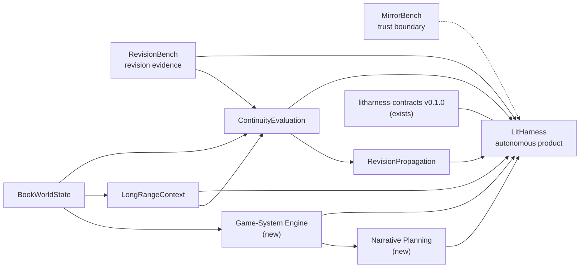

# LitHarness: Autonomous Book-Production System Plan

**Version:** 2.2 (supersedes PLAN-v1-authoring-tool.md, archived in this folder)
**Status:** Master plan; **Stage 0 slices 1–3 implemented and green**
**Role:** A 24/7 autonomous system that plans, drafts, evaluates, repairs, and versions quality LitRPG books — directed by a human, never blocked on one
**Inspection baseline:** Local projects inspected 2026-08-12; v2 rewrite same day; §7/§8/§13/§15/§17/§20 re-verified later the same day (v2.1); **§7/§8.4/§13/§17/§20 re-verified against all nine repositories that evening (v2.2)**

**What v2.1 adds.** A core philosophy section (§1a): **the text is the product.**
v2 was strong on integrity, autonomy and mechanically-checkable correctness, and
had almost nothing to say about whether the prose is any good — its stated Stage 4
target was "readable", a bar that cannot fail. §1a makes text quality the goal that
the rest of the document serves, names the six things quality actually means here,
and identifies the structural hazard: this plan's incentive gradient points at
whatever is gateable, and none of the deterministic gates measure quality at all.
Threaded into §2, §3, §10, §17 and §19.

**What v2.2 corrects, and the pattern it should finally settle.** v2.1 opened by
noting that v2 "consistently *understated* subsystem maturity" and struck two
already-complete actions. A same-evening re-verification against all nine
repositories found v2.1 had done it again: **§20.1 was completed eight minutes
before the edit that called it the cheapest unblock**; §20.2's pack was done and
§7/§8.4 still described the package as empty; §20.7's A3d was built *and its
decomposition had already answered the question the action existed to ask*; §20.4
undercounted its own test suite by 46; §20.5's second wall was owned elsewhere; and
§20.8's blocker had moved. Two things go the other way and are worth as much:
§7's "byte-reproducible" claim about LongRangeContext is the plan's one
**over**statement, and §20.4's diagnosis that three remaining items "all need
subsystems that do not exist yet" was **wrong about the one that was actually
buildable** — the real obstacle was a missing column no document named. The
standing instruction that follows: **an unstruck action in §20 is a claim to
re-verify, not a task to start.** Every row in §7 now carries what was checked.

**What v2.1 corrects.** The v2 inventory was written from a partly stale reading and
consistently *understated* subsystem maturity, which mattered because it scheduled
work that was already finished and mis-premised work that was not yet possible.
Two actions in §20 were already complete (BookWorldState's commit/license/tag, and
the RevisionJudge pair export); the nominated "cheapest unblock" pointed at the
wrong repository; §8.1's route into BookWorldState's predicate registry is not
currently buildable; §8.2's status-block rule was under-specified in two ways the
golden fixture disproves; §8.3's gate has a vacuous leg and a false-green path; and
§7 and §8 assigned the same invariants over the same fixture to two projects. All
corrected in place, with the superseded claims kept visible where the direction of
the error is itself informative. Companion document:
[plan/provider-adapters.md](plan/provider-adapters.md).

## 0. What changed from v1 and why

v1 designed a human-in-the-loop authoring tool: every consequential change routed
through author approval, a full editor UI carried the consent burden, and autonomy
was an explicit non-goal. A review judged it correctly: *"this plan will reliably
prevent an AI from ruining a book. It does not yet contain the machinery for an AI
to write one."*

v2 keeps everything the review called strong — the detect → scoped repair → verify
architecture, the state-layer separation, the trust posture ("no proposal becomes
canon merely because a model returned it"), the provenance and promotion discipline —
and changes the product identity:

1. **Autonomy is the product.** A policy engine (the Conductor) replaces the inline
   human gate. Humans direct, audit, and calibrate asynchronously; the system makes
   progress 24/7 without them.
2. **Two new pillar subsystems:** Narrative Planning (the creative half v1 assumed
   an author would do) and the Game-System Engine (LitRPG mechanics as a
   deterministic simulation, the genre's cheapest and most defensible quality claim).
3. **Book Zero is a scheduled milestone:** a complete, deliberately ugly 50k+ word
   draft produced end-to-end early, whose concrete failures reprioritize the
   research programs.
4. **The human quality-calibration program is on the critical path** — it is the
   prerequisite for any trusted autonomous accept/reject gate.
5. **Scope cut:** full editor UI, plugin sandbox, DOCX/EPUB polish, branch-merge UI,
   and the commercial-SaaS operational bar are deferred. The UI is a director's
   console, not an editor.
6. **Serial publication** (Royal Road-shaped chapter cadence) is a first-class
   export target; book-shaped export follows.

## 1. Executive summary

LitHarness is an always-on book factory with a human director. It runs on a
cron-like heartbeat: every tick, the Conductor ingests any new human directives,
selects the highest-value unit of work (draft a scene, evaluate a chapter, repair a
finding, propagate an accepted change, recompute derived artifacts), executes it
within budget, applies machine-checkable acceptance policy, and commits or
escalates. A human can steer at any time — premise, constraints, tone notes,
structural direction, vetoes — and reviews an exception queue and daily digest, not
every commit.

The architectural bet, supported by RevisionBench's measurements, is unchanged:
**detect → scoped repair → verify**, never open-ended "improve this" revision.
Unchanged text is structurally ineligible for revision unless a located complaint
licenses it. Model self-report is never a correctness signal (MirrorBench).
Acceptance is earned by passing deterministic gates first, calibrated critics second,
and sampled human audit third.

The sibling projects remain research incubators feeding validated pieces into this
product behind versioned contracts. `litharness-contracts` v0.1.0 now exists with
two span-exact golden fixtures (a six-scene mystery and a six-scene LitRPG book with
planted, mechanically checkable defects); all subsystems consume it rather than
importing each other.

## 1a. Core philosophy: the text is the product

**The purpose of this system is books a genre reader chooses to keep reading, and
recommends to someone else.** Everything else in this document — the Conductor, the
gate ladder, the provenance chain, the immutable revision store, the Game-System
Engine, the 24/7 operation — is scaffolding in service of that. Autonomy is *how*
the books get made. It is not what makes them good, and no amount of it substitutes
for the text being good.

This section is load-bearing, not preamble. Five consequences follow, and each one
cuts against something the rest of this plan would otherwise drift toward.

### 1a.1 Measurable is not the same as important

The plan's centre of gravity drifts toward whatever is mechanically checkable,
because that is what can be gated, tested, and reported green. Game-system
integrity is the extreme case: cheap, precise, defensible, and genuinely the
genre's best deterministic quality claim (§8) — **and a book with flawless ledger
arithmetic can still be dead on the page.**

Deterministic gates establish a **floor**: no contradictions, no impossible states,
no arithmetic errors, no continuity breaks. They say nothing whatever about whether
a scene lands. So:

- Every deterministic gate is **necessary and insufficient**. Passing the full
  ladder means the draft is not broken; it does not mean the draft is good.
- **Watch the effort ratio.** If a month of work moved only the floor, the project
  is off target however green the suite is. The suite cannot detect this — it is a
  judgment the director has to make deliberately, at review time, against this
  section.
- Beware the metric that is easy *because* it is shallow. Word count, scenes
  accepted per day, findings closed, and tokens spent are all trivially
  instrumentable and none of them is quality.

### 1a.2 Quality-first does not license open-ended revision

This is the trap a quality-first philosophy usually walks into, and the evidence
against it is already in hand: RevisionBench measured that order-consistent judges
preferred the *human originals* about 80% of the time. Models asked to improve prose
made it worse. Naive "polish this until it sings" loops would therefore lower
quality while burning budget.

The architecture stands unchanged: **detect → scoped repair → verify**, never
open-ended "improve this". Ambition about quality is expressed in what the system
**plans** and what it **detects** — richer craft detection, better beat design,
sharper located complaints — never in loosening the revision discipline. Unchanged
text stays structurally ineligible for revision unless a located complaint licenses
it.

### 1a.3 What "quality" means here, in priority order

Vague ambition is unactionable, so this is the concrete list, ordered by how much
each one moves a reader:

1. **Dramatic function.** Every scene changes something: a want pursued, a cost
   paid, a relationship or state altered. Scenes that only *convey information* are
   the single most common failure of generated prose, and they pass every
   deterministic gate in this document.
2. **Progression as drama, not bookkeeping.** LitRPG's system exists to create
   tension — scarcity, tradeoff, risk, the cost of a choice. A perfectly simulated
   system that never costs the protagonist anything is the genre's characteristic
   failure, and note that §8's engine makes this failure *easier* to ship, because
   the numbers will all reconcile.
3. **Escalation and payoff.** Promises planted get paid, on a cadence a reader can
   feel; stakes ratchet rather than reset.
4. **Voice.** A particular, consistent narrator; dialogue that distinguishes
   characters from each other.
5. **Line-level craft.** Concrete specificity over abstraction, varied sentence
   rhythm, no filler, no padding to length.
6. **Absence of AI tells.** Register drift, summarizing instead of dramatizing,
   tidy emotional resolution, the tricolon habit, the same three sentence shapes.

The floor gates in §4.2 cover none of items 1–6. That asymmetry is the central
engineering problem of this project, and naming it is the point of this section.

### 1a.4 Human judgment is the only ground truth for items 1–6

Which makes §10's calibration program not a scheduled nicety but **the measuring
instrument for the product's actual goal.** Two rules follow:

- **Any craft proxy is a hypothesis about human judgment until validated against
  it.** Pacing mix, tension curves, hook presence, dialogue ratio, sentence-length
  distribution — instrumentation, not gates, until held-out calibration shows they
  predict human preference. This is already §10's discipline; what changes is that
  it is the spine rather than a later stage.
- **A gold corpus of *good* prose is missing and needs authoring.** Both golden
  fixtures are *defect-detection* fixtures — planted errors and negative controls.
  Nothing in the program currently encodes what good looks like, so there is
  nothing for craft work to be measured against. Fixing this is a prerequisite for
  items 1–6 being anything but opinion.

### 1a.5 Set a bar that can fail, and refuse volume as a proxy

"A genre reader rates it readable" (§17 Stage 4, as written) is not a quality
target — it is a floor restated. Replace it with bars that can actually be failed:

- Blinded genre readers cannot reliably distinguish accepted chapters from
  published human LitRPG at the same tier.
- A majority of sampled chapters earn "I would keep reading" from readers who were
  not told what produced them.
- Once serialized, retention across consecutive chapters is measured and does not
  decay faster than a comparable human-written serial.

And one explicit anti-goal: **word count is not a success metric.** A 50k-word book
that reads is worth more than a 120k-word book that does not. This needs saying
because the autonomy machinery makes volume nearly free and quality expensive, so
the system will drift toward volume unless the plan forbids it.

A related constraint from the adapter layer
([plan/provider-adapters.md](plan/provider-adapters.md)): small local models are
appropriate for mechanical work — extraction, ledger replay input, summaries,
status-block rendering — and must **never** write prose that reaches an accepted
revision. Routing cheap models onto the page is the fastest available way to
violate this section.

## 2. Product goals

- **Produce LitRPG books worth reading** — planned, drafted, evaluated, repaired,
  and versioned — with no human action required for forward progress. Text quality
  is the goal (§1a); completeness and autonomy are how it gets delivered, and
  neither counts as success on its own.
- Accept human direction asynchronously at every altitude: premise, world rules,
  arc structure, chapter notes, line vetoes. Direction is durable and versioned;
  the system honors it without waiting for it.
- Guarantee game-system integrity: stat math, resource ledgers, level curves, skill
  and quest state machines are simulated deterministically and are never wrong in
  accepted prose.
- Maintain objective canon, character knowledge/belief, plans, and evidence as
  distinct layers; detect located continuity failures before inviting changes;
  repair within explicit scope and verify the complaint resolves.
- Keep every generated claim, finding, revision, and decision traceable to exact
  inputs, tool/model versions, and the policy that accepted it.
- Operate continuously within hard token/cost budgets, degrade gracefully, recover
  from crashes without losing or corrupting accepted work.
- Publish serially (chapter cadence with hooks and recaps) and export whole books.
- Work with local models or API providers behind adapters. Four: a deterministic
  fake, the local Claude Code session (default), the local Codex CLI (fallback),
  and Ollama (iterative testing and all mechanical calls). See
  [plan/provider-adapters.md](plan/provider-adapters.md).

## 3. Non-goals

- Inline human approval as a required step of the production loop. (Humans gate
  *policies*, exceptions, and samples — not each commit.)
- A promise that generated prose is objectively "better" than human prose. The
  claim this project will actually defend is narrower and testable: accepted prose
  meets a measured bar against human judgment (§1a.5), and its game-system
  arithmetic is never wrong. "Better than human" is not a measurable target;
  "indistinguishable from published genre work to a blinded reader" is.
- One universal style/structure/pacing formula; craft targets are per-book profiles.
- A general-purpose authoring editor for human writers. (v1's §14 UI is cut.)
- Autonomous publication to external platforms without an explicit human-set
  publication policy for that book. (Autonomous *drafting* needs no such gate;
  outward-facing posting always follows a configured policy.)
- Plugin marketplace, real-time collaboration, model self-confidence as evidence,
  mechanistic-interpretability machinery in the request path.
- Replacing legal review, sensitivity reading, or rights decisions.

## 4. The Conductor: 24/7 operating model

The Conductor is the subsystem v1 lacked. It is a durable scheduler plus a policy
engine — the "author" role decomposed into machine-checkable parts.

### 4.1 Heartbeat and scheduling

- A cron-style tick (Windows Task Scheduler / cron; every 5–15 minutes) launches or
  wakes the Conductor. A lease/lock guarantees single-instance execution; a missed
  heartbeat is observable. A resident daemon with the same tick contract is an
  optimization, not a requirement.
- Each tick: (1) ingest directives, (2) reconcile state (crashed jobs, expired
  leases, stale approvals), (3) select work, (4) execute one bounded unit, (5)
  commit artifacts + events atomically, (6) update the digest. Ticks are idempotent;
  all work runs through the existing durable job/outbox machinery.
- Work selection is a policy over the book's state: unblocked scenes to draft,
  findings to repair (severity-ordered), propagation plans to execute, derived
  artifacts to recompute, evaluations to run at milestones. A blocked or parked item
  never stalls the queue — the Conductor works elsewhere in the book.

### 4.2 Acceptance policy engine

Every candidate artifact meets a policy ladder instead of an author:

1. **Shape gates (deterministic, blocking):** parseable, in-scope span, length and
   structure limits, locked-content untouched, no unauthorized deletion.
2. **Integrity gates (deterministic, blocking):** game-system validation (§8),
   state/knowledge/POV checks, ledger arithmetic, continuity detectors at the
   current promotion tier, mechanical vetoes from RevisionBench (length movement,
   slop markers, punctuation/style drift, unintended deletion).
3. **Craft gates (calibrated, advisory → blocking after calibration):** critic
   thresholds only after the calibration program (§10) has measured them against
   human labels for that task. Uncalibrated critics annotate; they never gate.
4. **Budget gates:** per-operation, per-day, and per-book token/cost ceilings —
   metered in **invocations as well as tokens**. Both CLI adapters carry a fixed
   per-call harness tax (measured: ~24k input tokens for `claude -p`, ~14.8k for
   `codex exec`, the latter never caching), so token accounting alone hides a cost
   that scales with call count.

Decisions: **accept** | **retry** (bounded, with structured feedback from the failed
gate) | **repair** (spawn a detect→repair job for a located complaint) |
**regenerate** (fresh candidate, capped) | **park** (mark the unit stuck, move on) |
**escalate** (exception queue). Retry ladders are bounded everywhere; the failure
mode is a parked unit plus an exception, never a spin loop.

### 4.3 Human touchpoints (direct, don't operate)

- **Direction inbox:** a durable queue (file/DB) where the director drops premises,
  constraints, arc notes, tone guidance, vetoes, or "more dungeon crawling" at any
  time. The Conductor ingests at tick, converts directives into versioned locked
  plan constraints via the Narrative Planner, and records the interpretation for
  audit. Sort of like messaging an always-on agent: the book is the long-running
  session.
- **Exception queue:** escalations that policy cannot resolve (repeated gate
  failure, contradiction between locked constraints, budget exhaustion, publication
  decisions). Exceptions park only their unit of work.
- **Calibration sessions:** batch blinded judgments (RevisionJudge's protocol) that
  train and re-anchor the craft gates. Scheduled, bounded (30–60 min), and the only
  place human quality opinion enters the system.
- **Daily digest:** words drafted/accepted, findings opened/closed, spend vs.
  budget, escalations, samples for spot-reading.
- **Controls:** pause/resume per book, kill switch, policy editing (gate thresholds,
  budget ceilings, publication policy) — all config, all versioned.

## 5. Architecture at a glance

```text
        Direction inbox        Exception queue / digest
               \                     /
                ── Conductor ───────
                (scheduler + acceptance policy + budget governor)
                        |
   Narrative Planner    |     Game-System Engine
        \               |        /
Manuscript IR & version store ---- Event log / jobs / outbox
   |          |          |                    |
 Plans   World State  Dependency Graph   Observability
   |          |          |
   +---- Context Assembly ----+
              |               |
         Generation       Evaluation
              |               |
      Candidate patch   Structured findings
              \              /
          Revision planner
                 |
        Acceptance policy (gates)
                 |
        New immutable revision → serialization/export
```

Subsystems communicate through versioned contracts and immutable artifact
references. Model adapters stay at the edge. The Conductor owns workflow state and
transactions; no subsystem mutates canon directly.

## 6. Research dependency and integration graph



Priority order for the autonomous goal: Game-System Engine and Narrative Planning
outrank RevisionPropagation. LongRangeContext, ContinuityEvaluation, and
RevisionPropagation earn integration through Book Zero's observed failures, not
through a priori scheduling.

## 7. Subsystem inventory

Re-verified by direct inspection **2026-08-12 evening (v2.2 pass; supersedes the
two earlier passes the same day)**. The earlier row values are kept in the notes
where they were wrong, because the *direction* of the error matters — this plan
consistently understated maturity and therefore scheduled work that was already
done, and **the v2.1 pass did it again in six more places**:

| Project | State | Role in v2 |
|---|---|---|
| litharness-contracts | v0.1.0, 113 tests, 25 schemas, mystery + litrpg golden fixtures. **Now a git repo** (branch `main`, 3 commits, clean tree, no remote, no tags). **Still no LICENSE** — README says "License: TBD" | Shared schemas + gold benchmarks. The 1.x minors (§20.3) are the live work; version (don't freeze) after Book Zero. *(Struck: "untracked, no git repo" and "version-controlling it is the single cheapest unblock" — the commit landed 2026-08-12 17:36, eight minutes **before** the v2.1 edit that still called it untracked.)* |
| **LitHarness (this repo)** | **Stage 0 slices 1–3: 122 tests collected, 119 passing + 3 opt-in live, ruff clean, mypy strict clean. Under version control as of the v2.2 pass** (`.gitattributes` pins `eol=lf`; `core.autocrlf=true` is set globally on this machine and has already bitten this project once) | The product. **This table previously audited every sibling's VCS status and had no row for the product repo, which was itself untracked.** |
| BookWorldState | Committed, Apache-2.0, tagged `v0.1.0`, pushed to GitHub; **13 commits, working tree clean**; 100 tests passing. Ships an authenticated versioned WSGI API, transactional outbox with capped-exponential-retry worker, signed webhook publication, migration checksums, online backup/restore + destructive-corruption drill — **Milestone 4/5 infrastructure, not "~Milestone 2"**. What is *not* done is M3's evaluation corpus | State substrate. Its closed predicate registry is **not** injectable yet (§20.5) — but §8.4 routes around this deliberately, so it is not a blocker for §8. *(Struck: "working tree is not clean", "4 commits", "~Milestone 2 complete", "the real blocker for §8" — all four false.)* |
| RevisionBench | Mature (**411** tests). A2d complaint-gated repair, the LitRPG stratum, **and A3d** have landed — A3d shipped *under the name A2d*, and best-of-N repair ranked by minimal intervention closed the last element in `22a228d` | Source of repair policy, mechanical vetoes, LitRPG stratum evidence. **Its M5 decomposition is done and has already answered the question §20.7 was scheduled to ask** — see the redirect there. *(Struck: "405 tests", "A3d is next".)* |
| RevisionJudge | Built; 104 pairs exported, exactly 2 verdicts collected; one uncommitted file (`data/verdicts.jsonl`) | The calibration instrument for §10; the missing half is the verdict *consumer*, not the export. Nothing anywhere under `C:/DEV` reads `verdicts.jsonl` |
| MirrorBench | M0–M4 done, M5.0 landed (1,317 tests). One **unpushed** commit; its own README still says "M5 not started", contradicting its plan.md | Methodological invariants only; **verified zero coupling in both directions** — no import, no shared schema, no fixture exchange |
| LongRangeContext | M0 complete, gated, reported (2,435 src lines, 14 tests). **Not a git repo, and no LICENSE despite `pyproject.toml` declaring Apache-2.0.** Carries the exact `==0.1.0` contracts pin §20.3 wants relaxed | Promote further milestones when Book Zero shows distant-context failures (it will); simple baseline until then. **"Byte-reproducible" was this plan's one *over*statement**: `reporting.py:97,152` bake an absolute machine path into both artifacts, and the test named `test_m0_report_is_reproducible_*` never compares bytes |
| ContinuityEvaluation | **The LitRPG rules pack has landed: six deterministic detectors, 42 tests, exact-set span equality, mutation-tested, byte-identical across runs** (§20.2). Both fixture families load. **Not a git repo, no LICENSE**; the wheel in `dist/` predates the pack, and CE's own PLAN/README never mention it | Owner of the LitRPG rule and predicate vocabulary (§8.4). Prose detectors next. *(Struck: "five working deterministic detectors, 20 tests… hard-gated to the mystery fixture only".)* |
| RevisionPropagation | Plan only — literally one file (the row this plan has consistently had right) | Deterministic invalidation slice only, when Book Zero's edit churn demands it. Note its M0 proposes authoring change/impact/plan/event schemas **that contracts already ships**, and its plan never mentions contracts |
| **Narrative Planning** | **Does not exist — create** | §9. The creative half; biggest hole v1 left |
| **Game-System Engine** | **Does not exist — create** | §8. The genre half; highest-precision quality claim. Ships as a detector pack inside ContinuityEvaluation first, promoted to its own package when a generator exists to constrain (§8.4) |

Two structural facts this table used to hide. **BookWorldState does not consume
litharness-contracts at all** — `dependencies = []`, and no reference to
contracts, conductor, litrpg or game-system anywhere in its tree; the
shared-schema integration is unstarted, not partial. And on version control: of
the eight subprojects **plus this one**, BookWorldState, RevisionBench,
RevisionJudge, MirrorBench, litharness-contracts and LitHarness are now git
repositories; **LongRangeContext, ContinuityEvaluation and RevisionPropagation
are not** — and ContinuityEvaluation is the sharp case, holding 42 tests of
freshly-landed pack work with no history and no rollback.

## 8. Game-System Engine (new pillar)

LitRPG's defining property: part of the fiction is a formal system. Exploit it.

### 8.1 Responsibility

A deterministic, model-free simulation of the book's game mechanics, layered on
BookWorldState's closed predicate registry:

- character sheets: stats, HP/MP ceilings, XP and level curves, skills with
  acquisition events and level requirements;
- economy: currency ledgers, inventory with acquisition/transfer/consumption
  events, unique-item constraints, loot tables authored as world rules;
- quest and progression state machines: accepted → active → completed transitions
  bound to narrative events;
- system voice: blue-box/status-window rendering as first-class manuscript blocks
  (a `Block` kind in the IR with structured payload + rendered text), diffable and
  verifiable like any other span.

### 8.2 Contract with generation

Generation is **constrained by** the engine (the context packet includes the
current sheet, legal actions, and pending obligations) and **validated against** it
(every accepted scene's extracted events must replay cleanly through the
simulation; every status block must equal the simulated state at that story
position). A scene that grants an unearned level or spends gold that isn't there
fails an integrity gate — no critic involved, no human involved.

**Resync, don't carry forward — and only simulate what events can derive.** The
sentence above, read as a pure fold, is wrong in two ways that the litrpg fixture
exposes concretely, so the semantics are pinned here:

1. **Report-then-resync.** After emitting a mismatch at a story position, the
   sheet resyncs to the *asserted* value before continuing. A carry-forward fold
   over the fixture's gold ledger yields four findings (s3 20-vs-15, then s4, s5,
   and s6 5-vs-0) where gold labels exactly one — and the spurious s6 divergence
   lands on a span byte-identical to the negative control
   `f-control-status-repetition`, so pure fold fails the control clause by span
   collision. One defect must produce one finding, not a cascade.
2. **Simulate only what the event vocabulary supports.** In the fixture that is
   `gold` and `level`. No record carries an HP or MP delta — the complete event
   vocabulary is `purchased, paid, used_skill, consumed, leveled_up, used_item,
   acquired_skill, quest_completed` — yet snapshots move HP 24→22→34→27 for
   reasons that exist only in prose. `hp/mp/hp_max/mp_max` are snapshot-supplied
   and checked by the intra-snapshot ceiling rule, never simulated. Simulating
   them emits false positives at s3, s5 and s6.

### 8.3 Evidence base and gates

The litrpg golden fixture in litharness-contracts (gold ledger arithmetic, HP
ceiling, level monotonicity, skill-before-acquisition, quest-state, ghost item) is
the conformance suite; RevisionBench's LitRPG stratum (99% recall / 88% precision
cross-chapter on templated prose) is the evidence this class of check scales.
Promotion gates: 100% recall on the fixture's planted defect classes, zero findings
on its negative controls, replay determinism, and validation of model-written (not
templated) chapters — the known gap RevisionBench has already flagged.

**Four clauses, and only three are reachable before Stage 1.** Model-written
chapters do not exist until generation does, so fixture work closes three of four
and is explicitly *not* promotion. Say so when reporting it; a green fixture gate
otherwise reads as more than it is.

**The stated gate is also not sufficient on its own.** Three defects in it, each
verified against the fixture, each of which would let a false green through:

- **Recall is the wrong measure — grade exact-set equality** on
  `(category, subtype, rule_or_critic_id, primary_span)`. `consumed red_potion`
  has no acquisition record anywhere, making it structurally identical to the
  planted silver-key ghost, yet it is not a labeled defect. A principled ghost
  rule emits seven findings against six gold; recall-only passes it. The only
  mechanical discriminator is `used_item` vs `consumed`, and narrowing to
  `used_item` leaves a population of exactly one — a check indistinguishable from
  `assert True`. Escalate that as a fixture inconsistency rather than hardcoding
  around it.
- **The negative-control clause is vacuous for record-based checks.** Both
  controls are prose-only phenomena with prose-only rule ids (`style.flavor.v0`,
  `repetition.format.v0`) and no backing state records, so a record-only engine
  cannot fire on them at all. Replace that leg with **mutation testing**: perturb
  the fixture in memory (set s3 gold to 20, s4 HP to 30, s5 level to 4, move the
  skill-acquisition order key earlier) and require the corresponding detector to go
  *silent*; then perturb a conforming step and require a new finding. Three of the
  six checks have a fixture population of one and zero negative examples, so
  without this leg half the suite is tautological.
- **Strip the answer key before the engine sees state.** `note` is a declared
  field on `StateRecord`, and five of six planted defects are annotated with their
  own finding id (*"Gold 15 is what the prose says; the ledger-correct value is 20.
  See f-gold-ledger."*). A 6/6 gate is reachable by regexing `note` for `See f-`.
  ContinuityEvaluation's corpus builder **already closes this by construction** —
  it projects each state record onto a fixed field list that does not include
  `note` — which is one more reason to build there rather than against raw
  `state.json` (§8.4). Preserve the property deliberately: keep `note` out of the
  corpus projection and assert the detector modules never reference the field.

### 8.4 Where this gets built, and who owns the vocabulary

§7 and §8 previously assigned the identical invariants over the identical fixture
to two different projects, which would produce two divergent predicate
vocabularies over one fixture and a permanent reconciliation tax. Resolved: **the
LitRPG rule and predicate vocabulary is owned by the game-mechanics pack, and that
pack lives inside ContinuityEvaluation until a generator exists to constrain.**

Build the six checks and the gold-ledger fold there, not greenfield. That repo
already has the fixture loader, the deterministic-detector registry, a
schema-validating Finding emitter (`rule_or_critic_id`, `confidence_basis:
"deterministic"`, content-addressed finding ids, claim objects), the
`input_digest`/`config_hash` determinism machinery, and a conformance harness
*stricter* than a new one would start out — it already asserts total finding
count, the precision gate a recall-only design omits.

**This is now done — the paragraph above describes a decision, not pending work.**
*(Struck: "It also has a reserved, empty `detectors/rules/` package whose one-line
docstring reads 'Closed world-rule detectors are reserved for a later milestone.'
The only obstacle is a self-inflicted `contract_fixture_id != "mystery"` check
that raises before the litrpg fixture can load, plus a three-branch predicate
translator that silently drops every predicate it does not recognise." The package
is full, the fixture gate is an enum, and the translator is table-driven — see
§20.2 and [plan/litrpg-rules-pack.md](plan/litrpg-rules-pack.md).)*

A standalone Game-System Engine package earns its existence at §8.2's *forward*
interface — the context packet carrying sheet, legal actions and pending
obligations — which has no consumer until Stage 0/1 exists. A simulator that only
runs backwards over one fixture is an evaluator, and evaluators belong in the
evaluator. Promoting the fold out later is a move, not a redesign.

Keep BookWorldState behind an unimplemented port for now. §8.1's "layered on
BookWorldState's closed predicate registry" is not currently buildable (§20.4),
and BookWorldState has no WorldRule implementation to host the fixture's two
`author_locked` rules in any case.

## 9. Narrative Planning (new pillar)

The hard creative problem v1 delegated to an absent author.

### 9.1 Responsibility

- Generate and maintain the book plan: premise → arc structure → act/chapter
  outline → scene beat sheets, all as versioned `PlanSnapshot` items with
  authority levels (directive-locked / intended / possible).
- Maintain a **foreshadow-payoff ledger**: every planted promise carries a target
  window; the planner schedules payoffs and the evaluator flags overdue ones.
- Maintain a **progression schedule** (LitRPG-specific): level-up cadence, power
  milestones, new-mechanic introduction rate — planned against the Game-System
  Engine so the plan is mechanically satisfiable.
- Convert human directives into plan deltas with recorded interpretation;
  replan downstream beats when the director changes course, through the standard
  change/propagation machinery.
- Serialization awareness: chapter-end hook placement, recap needs, arc positioning
  within a serial cadence.

### 9.2 Discipline

Plans are proposals against gates like everything else: structural validity
(beats reference real entities/threads), mechanical satisfiability (progression
schedule replays), constraint consistency (no beat contradicts a locked directive),
and — once calibrated — craft critics for arc shape. Planning research runs as its
own incubator with the same benchmark discipline as the others: authored gold
outlines, adversarial cases (directive conflicts, mid-book pivots), and
plan-quality measured by downstream draft outcomes, not plan aesthetics.

## 10. Quality gates and the calibration program (critical path)

This section is the measuring instrument for §1a — the product's actual goal — not
merely the gate that lets autonomy run unattended. Read it that way: the
deterministic ladder below protects the floor, and everything in steps 2–5 is the
only machinery in this document that can register whether the text is any good.

Autonomy requires a trusted accept/reject signal. Today, none exists: RevisionBench
measured that raw model-judge verdicts were 43–65% positional artifacts, and
order-consistent survivors preferred human originals ~80% of the time. So:

1. **Deterministic floor now.** Game-system integrity, continuity detectors,
   mechanical vetoes, schema/scope checks. These gate from day one.
2. **Craft instrumentation next.** Cheap, deterministic proxies logged per scene
   and chapter — pacing profile (action/dialogue/exposition mix), tension-curve
   heuristics, chapter-end hook presence, dialogue ratio, sentence-length
   distribution, repetition beyond the intentional-motif ledger, progression-payoff
   cadence vs. plan. Instrumented from Book Zero; **advisory** until validated.
   Add proxies aimed at §1a.3's list, which the existing set barely touches:
   **scene dramatic function** (does state change across the scene, or is the scene
   pure information transfer — the most common generated-prose failure),
   **progression cost** (does a level, skill or item acquisition carry a paid cost,
   or does the system only ever give), **voice consistency** across chapters, and
   **dialogue distinctiveness** between characters. These are harder and less
   reliable than counting sentence lengths, which is exactly why they are worth
   building — the easy proxies measure the things that matter least.
3. **Human calibration as a scheduled program, not a footnote.** Weekly bounded
   RevisionJudge sessions over current output: blinded, order-randomized,
   with planted-defect attention controls. Output: calibrated thresholds tying
   critic scores and craft metrics to human judgment, per task and genre.
4. **Critic promotion.** A critic (or metric) becomes a blocking gate only after
   held-out calibration shows usable precision at an acceptable workload, with
   order-consistency and abstention measured. Until then the Conductor treats it as
   annotation.
5. **Standing audit.** Even at full autonomy, the policy engine routes a sample
   (e.g. 5% of accepted chapters) to the digest for human spot-reading; audit
   disagreement re-opens calibration.
6. **A craft reference corpus.** Both golden fixtures encode *defects* — planted
   errors with negative controls. Nothing in the program encodes what good looks
   like, so craft work currently has nothing to be measured against (§1a.4).
   Author one: passages that exemplify each item in §1a.3, paired where possible
   with a weaker variant of the same beat, so a proxy can be tested for whether it
   separates them. Human work, and a prerequisite rather than a nice-to-have —
   without it, every craft claim in this project reduces to opinion.

## 11. Manuscript IR and state architecture

Carried from v1 §9 with one addition. The IR remains a typed ordered tree
(Book → Part? → Chapter → Scene → Block → TextSpan) with stable logical IDs,
immutable versions, branch scoping, reorder-friendly position keys, content hashes,
locks, tombstones. **Addition:** `Block` gains a structured kind for game-system
displays (status windows, level-up notices, quest text) carrying both machine
payload and rendered text, so diffing, evidence spans, detection, and export treat
system voice as data, not decoration.

State layers are unchanged and remain the plan's spine: manuscript truth / author
canon (now: **director canon**) / plans / objective story state / perspective state
/ derived artifacts / proposals. No proposal becomes accepted prose or canon
merely because a model returned it — acceptance is a policy decision with recorded
gates.

Revision identity, event/outbox architecture, persistence approach (relational +
blob + FTS; SQLite acceptable for single-node alpha), reproducibility levels, and
failure recovery carry over from v1 (§9.3, §13, §16, §19) unchanged in substance.
They are what makes 24/7 unattended operation survivable, and they were the best
part of v1.

## 12. The autonomous production loop

Per unit of work (scene draft shown; repair/replan analogous):

1. **Select** — Conductor picks the next unblocked beat from the plan.
2. **Assemble** — context packet from frozen revision: local prose, beat sheet,
   locked constraints, game state + legal actions, POV-visible knowledge, open
   threads, distant callbacks (simple baseline until LongRangeContext promotes).
3. **Generate** — provider adapter, frozen profile, candidate artifact.
4. **Gate: shape** — parse, scope, length, locks. Fail → bounded retry with
   structured feedback.
5. **Extract** — state candidates (events, ledger movements, knowledge changes)
   via provider-independent extraction; replay through Game-System Engine.
6. **Gate: integrity** — simulation replay, status-block equality, continuity
   detectors, mechanical vetoes. Fail → retry / detect→repair / park + escalate.
7. **Gate: craft** — calibrated thresholds if promoted; otherwise annotate.
8. **Commit** — accept candidate + state records + provenance + events atomically;
   policy decision recorded with every gate result.
9. **Propagate** — invalidate/recompute derived artifacts; schedule follow-on work
   (summaries, evaluations, next beat).
10. **Digest** — append to the daily report; sample for audit per policy.

Director directives can inject at any tick; they land as plan deltas (step 1's
input), never as mid-flight mutation of a running job.

## 13. Contracts

`litharness-contracts` v0.1.0 exists and is the interchange layer (IDs, evidence
spans, envelopes, findings, change sets, gold suites; 25 schemas; two golden
fixtures with span-exact annotations). It is **now under version control** (3
commits, clean tree) but **still unlicensed** — §20.1. Policy for v2:

- **Version, don't freeze.** Expect additive minor versions after Book Zero; treat
  the first breaking rework (2.0) as a scheduled consequence of Book Zero's
  lessons, not a failure. Note the wire `SCHEMA_VERSION` is `1.0.0` and the
  compatibility gate rejects a differing major, so the near-term additions ship as
  **1.x minors** regardless of this document calling them "v2".
- **What contracts does and does not pin.** It fixes the vocabulary — the
  `JobStatus` state machine, `JobRecord`'s `idempotency_key`/`input_digest`/
  `attempts`, `position_key` as a string (the fixture demonstrates gap-10
  `"010".."060"`), single-parent `parent_revision_id`, and the *absence* of a
  manuscript-span resource kind, which settles v1's TextSpan-node-versus-coordinate
  question in favour of coordinates. It pins almost none of the invariants: every
  schema is `additionalProperties: true` with thin `required` lists. Leases are
  absent entirely and are genuinely net-new.
- **Additions needed for v2 pillars** (minor versions): plan-graph artifacts
  (beat, arc, foreshadow-payoff ledger entries, progression schedule), game-system
  schemas (character sheet, ledger event, quest state, status-block payload),
  Conductor artifacts (directive, policy decision record, exception, digest entry).
- Consumption rules stand: siblings depend on contracts, never on each other;
  negative controls in the fixtures are as load-bearing as defects.

## 14. Director console (was: full editor UI)

A thin surface over the queues and config, in priority order: direction inbox
composer; exception queue with decision actions; daily digest with sampled reading
view (with provenance drill-down); plan browser (arc → chapter → beat, with
directive lineage); findings browser; budget/policy editor; pause/kill controls.
Reading and steering, not editing — line edits enter as directives ("veto this
sentence", "rewrite this scene with X"), which become located complaints for the
standard repair path. The v1 editor, branch-merge UI, and context-inspection
panels are deferred until a human editing workflow is actually wanted.

## 15. Cost model and throughput (to validate in Book Zero)

Order-of-magnitude estimate, marked as hypothesis: a 100k-word draft ≈ 140–160
scenes. Per accepted scene: generation 2–4k output tokens, extraction ~1k,
evaluation ~1–2k, retries/repairs amortized ×1.5–2.5 → roughly **10–20k model
tokens per accepted scene**, i.e. **2–4M tokens per clean draft pass**, 5–10M with
revision passes. At local-model cost: hardware time only. At API mid-tier pricing:
tens of dollars per draft. Throughput: even one accepted scene per 10-minute tick
sustains a draft in under two weeks of wall-clock with large margin; the binding
constraint will be gate failure rates, not raw generation. Book Zero instruments
all of this: tokens and wall-clock per accepted scene, retry distribution, gate
failure taxonomy, cost per chapter. Budget governor enforces per-day and per-book
ceilings with parking + escalation on exhaustion.

**Add the per-invocation harness tax — it is not in the estimate above and it is
larger than the payload.** Measured 2026-08-12 (details in
[plan/provider-adapters.md](plan/provider-adapters.md)): `claude -p` carries ~24k
input tokens of its own system prompt and tool definitions per call, of which ~19k
cache-reads and ~5k is re-written every time, giving a floor of ~$0.013 per call on
Haiku and ~3.5–4.2 s wall; `codex exec` carries ~14.8k and **never** caches. At
~1,000 invocations for a draft that is ~7M overhead tokens on Claude or ~15M on
Codex, against a 2–4M payload estimate — 2–7× the actual work. Two consequences:
mechanical calls (extraction, gate feedback, summaries, status-block rendering)
route to Ollama even in production, and multiple asks fold into one invocation
rather than chaining calls that each re-pay the tax.

## 16. Serial publication

LitRPG's native form is serialized chapters (Royal Road cadence), so serialization
precedes book-shaped export:

- chapter release units with hook placement (planner concern) and recap
  generation (context concern) as explicit artifacts;
- per-chapter export: clean HTML/Markdown with correctly rendered status blocks;
- a **publication policy** per book, human-set: manual (export only), queued
  (human clicks post), or scheduled (autonomous posting at cadence). Outward
  publication always follows the configured policy; drafting never waits on it;
- published chapters become high-preservation spans: post-publication retcons go
  through propagation with an explicit erratum/consistency policy rather than
  silent rewrites;
- whole-book Markdown export follows; DOCX/EPUB polish is deferred (§18).

## 17. Roadmap

Gates, not dates. Stages 0–2 are largely v1's foundation, slimmed; Stage 3 is the
pivot v1 never had.

### Stage 0 — Foundation
~~Version-control litharness-contracts~~ (§20.1 — done; LitHarness itself too).
Scaffold LitHarness: manuscript IR
(including status-block kind), immutable revisions, jobs/outbox, the four provider
adapters, Conductor skeleton (tick, lease, job selection, digest stub). Contracts
already exist; add the schema additions as 1.x minors.
**Exit:** revisions, patches, events, and restore work end-to-end without a model;
the Conductor ticks idempotently for a week unattended (no-op workload); each
configured adapter passes a conformance suite (schema conformance, usage reporting,
a round-trip health probe, timeout, and a forced fallback); and `LITHARNESS_ENV=test`
provably cannot reach a paid provider.
*(Struck from Stage 0: "commit/license/tag BookWorldState" — already done.)*

### Stage 1 — Closed autonomous slice
Six-scene golden book drafted end-to-end **with no human in the loop**: template
planner (fixed beat sheet), simple context baseline, game-system replay validation
(sheets and ledgers — built per §8.4 as a ContinuityEvaluation rules pack, not a
separate package), deterministic gates, bounded retries, exception queue
functioning.
**Exit:** the mystery and litrpg fixture books regenerate from premise to accepted
six-scene draft autonomously; zero silent mutation; every acceptance carries a
recorded policy decision; planted-defect injection is caught by gates, not luck.

### Stage 2 — Detect and scoped repair
Promote RevisionBench's A3d detect–repair–verify results into the repair path;
integrate the LitRPG deterministic detector pack (ContinuityEvaluation's first
slice); repairs triggered by findings, verified by re-detection, bounded by vetoes.
**Exit:** detect-then-repair beats revise-then-gate on affected-span precision and
preservation on held-out material (RevisionBench's own promotion gate).

### Stage 3 — Book Zero (the pivot)
One complete 50k–80k word LitRPG draft, end-to-end, 24/7 unattended: Narrative
Planner v0 (arc template + beat generation + foreshadow ledger + progression
schedule), simple context, full gate ladder, craft instrumentation logging,
budget governor live. The draft is *expected to be mediocre*; producing it is the
point. **This is the one stage where §1a is deliberately suspended, and only
because Book Zero is instrumentation rather than a product** — its output is a
failure taxonomy, not a book anyone is asked to read. Do not let the exemption
leak: a "Book Zero is allowed to be bad" habit applied to Stage 4 onward would
quietly become the project's quality standard.
**Exit:** the draft exists, produced without inline human action; a written failure
taxonomy (what broke: distant context? pacing? payoff? repetition? cost?) with
frequencies; instrumentation and cost data. **Book Zero's taxonomy reprioritizes
Stages 4–6 — the plan commits to following the evidence, not this document.**

### Stage 4 — Calibrated quality gate
Stand up the weekly calibration program (RevisionJudge protocol) over Book Zero
output; validate/discard craft metrics against human judgment; promote the first
calibrated critic thresholds to blocking; author the craft reference corpus (§10.6);
regenerate or repair Book Zero's worst chapters under the new gates → **Book One**.
Target per §1a.5, not "readable": blinded genre readers cannot reliably distinguish
accepted chapters from published human LitRPG at the same tier, a majority of
sampled chapters earn "I would keep reading" from readers not told what produced
them, and the system math is flawless. The first two can fail; "readable" could not,
which is why it was the wrong bar.
**Exit:** a blocking craft gate with measured held-out precision exists; Book One
produced under it.

### Stage 5 — Scale the weak subsystem
Integrate LongRangeContext / ContinuityEvaluation prose detectors /
RevisionPropagation slices **in the order Book Zero's taxonomy demands**, each
through its own incubator gates. Likely first: distant-callback context and
overdue-payoff detection.
**Exit:** the dominant Book Zero failure class measurably reduced in a Book One+
draft at equal budget.

### Stage 6 — Serial operation
Publication pipeline (§16), chapter cadence, recaps, publication policies;
multi-book direction (a second book started while the first serializes); operator
playbook (backup/restore drills, budget reviews, calibration cadence).
**Exit:** one book serializing on schedule under a queued-or-scheduled policy;
a second in drafting; a month of unattended operation with only directive/exception
/calibration touches.

### Stage 7 — Series and steady state
Series continuity (cross-book canon via BookWorldState branches), genre profile
variation, provider failover, cost optimization. Production claims per v1's
reproducibility levels.

## 18. Deferred / cut (explicitly)

Deferred until a human-editing product is wanted: full editor UI, branch-merge UI,
context-inspection panels, real-time collaboration. Deferred until distribution
demands: DOCX/EPUB polish (Markdown/HTML first), plugin sandbox/permissions and
third-party plugin surface, hosted-API providers beyond the four adapters in
[plan/provider-adapters.md](plan/provider-adapters.md). Cut from the
definition of done: v1 §26's commercial-SaaS bar (SLO dashboards, incident
response org, support playbooks, accessibility audits, multi-tenant security).
Kept absolutely: provenance, immutable versioning, deterministic gates, durable
jobs/outbox, crash recovery, backups, budget enforcement — autonomy stands on
these.

## 19. Definition of "operator-grade" (replaces v1 §26 "production grade")

The system is operator-grade when:

- **Integrity:** accepted prose, canon, plans, history, and policy decisions
  survive crashes, retries, upgrades, restore, and rollback; every mutation is
  attributable to a recorded policy decision and reversible.
- **Autonomy:** a directed book makes forward progress for 30 days with human
  input limited to directives, exceptions, and calibration; parked units and
  exceptions are visible and bounded; nothing spins.
- **Trust:** deterministic gates have zero known false-accepts on the fixture
  suites; blocking critics carry current calibration evidence; audit sampling
  runs and disagreements feed back.
- **Genre:** accepted prose contains zero game-system violations by replay;
  progression follows the planned schedule within tolerance.
- **Quality (§1a):** the blinded-reader bar of §1a.5 is measured, currently
  passing, and re-measured as output changes; the craft reference corpus exists and
  promoted craft gates carry held-out evidence that they predict human judgment.
  A system that satisfies every other clause here and fails this one is not
  operator-grade — it is a well-engineered machine for producing books nobody wants,
  and that is the specific failure this definition exists to prevent.
- **Economics:** per-book cost is measured, bounded, and enforced; the operator
  can see spend vs. plan at any tick.
- **Recovery:** restore from backup rebuilds all derived state from canonical
  records and events; a mid-write crash loses at most the in-flight unit.

## 20. Immediate next actions

Ordered as of the **2026-08-12 evening (v2.2) re-inspection**. The v2.1 list
struck two already-complete actions and congratulated itself on the correction;
this pass found that **three more had completed and a fourth had been answered**
in the hours since. The pattern is now the plan's most reliable property, so treat
every unstruck action below as a claim to re-verify rather than a task to start.

1. ~~**`git init` and commit litharness-contracts**~~ — **DONE.** Branch `main`,
   3 commits, clean tree. The commit landed at 17:36 on 2026-08-12; the v2.1 edit
   that called this "the actual cheapest unblock" was written at 17:45.
   **Remaining and real: it still has no LICENSE** (README says "License: TBD"),
   which is the follow-up the original action deferred to the owner.
   **Superseded by a bigger instance of the same defect, now also done:** LitHarness
   *itself* was untracked while carrying 15 modules and 119 passing tests, and §7's
   inventory audited every sibling's VCS status without having a row for the product
   repo. Now committed, with a `.gitattributes` that matters — `core.autocrlf=true`
   is global on this machine and plan/stage-0-decisions.md §1 records the near-miss
   it already caused in contracts.
   **Still outstanding, and now the sharpest case:** ContinuityEvaluation and
   LongRangeContext are still untracked, and CE is holding 42 tests of
   freshly-landed pack work with no history and no rollback.
   *(Struck: "commit, license and tag BookWorldState" — done. 13 commits, clean
   tree, tag `v0.1.0`, Apache-2.0 LICENSE, pushed. The v1 plan carried this
   forward for a release cycle after it stopped being true.)*
2. ~~**Build the LitRPG deterministic rules pack in ContinuityEvaluation**~~ —
   **DONE.** Six checks green against the litrpg golden fixture with span-level exact
   set equality, mutation-tested for sensitivity, byte-identical across runs; CE 20 →
   42 tests. See [plan/litrpg-rules-pack.md](plan/litrpg-rules-pack.md) §0 for what
   was built and the two places the spec was wrong. Original scope, for the record:
   change the `contract_fixture_id` const gate to an enum, replace the
   three-branch predicate translator with a table-driven one that carries
   `world_rule`, `event` and `thread` records through, add the six checks under
   the reserved `detectors/rules/`, and parameterize the slice-gate test off its
   hardcoded 5/3/5 counts. Apply every correction in §8.2 and §8.3 — resync
   semantics, gold-and-level only, exact-set equality, mutation testing, and
   `note` stripping — or the gate goes green while proving nothing. While in
   there, fix the machine-bound `samefile("C:/DEV/litharness-contracts/schemas")`
   in the contract test.
3. **Extend litharness-contracts with 1.x minors** — *not* "v2 minors": the wire
   `SCHEMA_VERSION` is `1.0.0` and the compatibility gate rejects a different
   major outright, so 2.0.0 would be refused by its own parser. Needed:
   game-system schemas, Conductor artifacts (directive, policy decision record,
   exception, digest entry), a `BlockKind` plus structured-payload field on
   `ManuscriptNode` (§11 requires it; `NodeKind` has a bare `block` member with no
   payload, and neither golden manuscript contains a single block node), and
   `lease_holder`/`lease_expires_at` on `JobRecord` (it has `idempotency_key`,
   `input_digest`, `attempts`, `error` and `status`, but no lease concept at all —
   leases are net-new, absent from v1 and from every schema). Shape
   `CharacterSheet` from action 2's working code, not ahead of it. Relax
   LongRangeContext's exact `==0.1.0` pin in the same change.
4. **Scaffold LitHarness Stage 0** — **slices 1–3 done** (122 tests collected, 119
   passing + 3 opt-in live, ruff clean,
   mypy strict clean). Slice 1, the model-free manuscript spine: canonical text and
   hashing, the IR with lock taxonomy and block payloads, immutable
   content-addressed revisions, bounded patch application with the mechanical veto
   list and a checked preservation guarantee, SQLite persistence with atomic
   revision+event commits, the transactional outbox, durable jobs with leases,
   restore-by-rebuild. Slice 2, the Conductor skeleton: idempotent tick, instance
   lease with single-leader enforcement, pluggable work selection, one bounded unit
   per tick, crash recovery, bounded retry, digest, and send-then-mark outbox
   dispatch. Ten open invariants settled and recorded in
   [plan/stage-0-decisions.md](plan/stage-0-decisions.md) rather than silently
   invented. **Not blocked on action 3 after all** — building the consumer first is
   what turned the lease, block-payload and event-type shapes from guesses into
   requirements. Slice 3, the provider adapters: all four built behind one contract,
   with a shared conformance suite, parsing verified against real captured CLI
   envelopes, and `LITHARNESS_ENV=test` enforced suite-wide so a test run provably
   cannot reach a paid provider.

   **Remaining, re-premised — the v2.2 pass found the blocker diagnosis wrong.**
   The claim was "directive ingestion, a real work-selection policy, and wiring the
   registry into a job handler — all three need subsystems that do not exist yet."
   That is true of one and a half of the three:

   - **Wiring the registry into a job handler is not blocked at all,** and the thing
     actually standing in the way is a column no planning document names: `Job`
     (`domain/jobs.py:86`) and the `jobs` table carry `input_digest` — *a hash* — and
     no input, so a handler satisfying the `JobHandler` protocol receives a job it
     cannot reconstruct a prompt from. `make_provider_handler` is a closure that
     satisfies `JobHandler` with zero Conductor changes, and
     `test_a_job_can_commit_a_revision_and_its_event_atomically` already proves a
     closure can commit revision+event in one transaction. This is slice 4.
   - **A real work-selection policy** is blocked on the plan graph and findings store
     as stated — but there is a second, purely local blocker the plan never named:
     `claim_next` hardcodes `ORDER BY rowid LIMIT 1`, so *no* ordering other than FIFO
     is expressible regardless of which subsystems exist. Land the `priority` column
     with slice 4; do not invent a severity policy until findings are persisted, or it
     is a selector over a column with one value.
   - **Directive ingestion** is genuinely half-blocked: capturing a directive needs
     nothing missing, interpreting one needs the Narrative Planner (§9, does not
     exist). It is additionally hard-blocked upstream — `Event.to_contract()` calls
     `lc.EventType(self.value)`, and contracts' enum has no `_missing_` hook, so
     emitting a `DirectiveIngested` event raises until action 3 ships. Defer.

   Also latent: `ProviderRegistry.reset_health()` documents "called at the start of a
   tick" and has no non-test caller, so a provider that recovers stays marked dead for
   the process's life. Harmless today because nothing owns a registry; a bug the
   moment slice 4 lands.

   **On the exit criterion, precisely:** the endurance property is *evidenced, not
   met.* `test_a_week_of_no_op_ticks_changes_nothing` runs the 2,016 ticks a week
   produces at the 5-minute cadence with injected time and proves state growth is
   bounded and accumulation idempotent. It does not prove a long-lived process
   survives a real week of scheduling, sleep, clock changes and file growth. Do not
   let "Stage 0 green" be reported as the stage being complete.
5. **Unblock the Game-System Engine's real dependency, then keep it at arm's
   length.** §8.1's "predicate registry extensions on BookWorldState" cannot begin
   as the code stands: `validate_record_references` takes no registry and calls
   `record.validate_predicate()` bare, defaulting to the closed 5-predicate
   `DEFAULT_PREDICATES`, and neither persistence adapter constructor accepts a
   registry — so a `game.*` assertion validates at the domain layer and is then
   rejected at commit time. The dependency-injection pattern is already idiomatic
   elsewhere in that codebase, making `validation.py` the single break in an
   otherwise complete chain — verified still true, and it is ~10 lines across 3 files
   with every new parameter defaulted, so no existing construction site changes.
   `PredicateDefinition` rejecting any predicate name without a dot, while every
   fixture predicate is bare (`status_snapshot`, `purchased`, `rule_hp_ceiling`), is
   also still true. *(Struck: "so a namespacing/mapping layer is required and someone
   must own that vocabulary" — §8.4 assigned that ownership to the game-mechanics
   pack, and ContinuityEvaluation now ships it. The mapping layer exists; it just
   does not live here.)*
   Hours of work, and **not** on the critical path — §8.4 routes around it, and this
   action advances no Stage exit criterion in §17. Do it when BookWorldState is being
   worked on for its own sake, not as LitHarness progress.
6. **Create the Narrative Planning incubator**: beat-sheet schema, template arc
   planner v0, foreshadow-payoff ledger, progression schedule; gold outlines +
   adversarial directive cases as its first benchmark. Note the ordering trap: the
   progression schedule references a level curve that only exists once the
   game-mechanics pack defines the sheet, and the litrpg fixture contains **no XP
   figure, no level curve and no milestones** (Rook reaches Level 4 because the
   System announces it), so cadence has nothing to attach to yet.
7. ~~**In RevisionBench, proceed with A3d and the M5 metric decomposition**~~ —
   **DONE, AND THE ANSWER IS IN. This is the most consequential correction in the
   v2.2 pass, because it is not a status update — it is the redirect this plan
   promised to obey.**
   A3d is built (it shipped under the name *A2d*; `docs/literature.md:220` titles the
   section "Detect-repair-verify (A3d)"), and the last unbuilt element — best-of-N
   repair ranked by minimal intervention — landed in `22a228d`. The M5 decomposition
   is done for the LitRPG stratum: `scripts/litrpg_eval.py` measures detection alone
   with no model calls, `scripts/litrpg_repair_run.py` measures repair given
   detection. Numbers are on disk: detection recall 0.987 / precision 0.883 with zero
   clean-chapter false positives; **recall 1.0 / precision 0.902 on model-written
   prose**, which also closes §8.3's "known gap" clause about templated-only
   validation. Repair resolved 61/63 and restored 55/63 with zero collateral chapters.

   **The verdict, verbatim from `docs/literature.md:215` — "Detection *was* the
   bottleneck… The 0.22 that looked like a repair problem was a detection problem."**
   This action's own stated rule was: *if the bottleneck is detection rather than
   repair, effort belongs in ContinuityEvaluation instead of the revision loop.* The
   condition is met. §17 Stage 2 and §6's priority order should be read through it —
   detector coverage outranks further work on the repair loop, and RevisionBench has
   handed the program a result it has not yet acted on.
   *(Struck: "export current pairs to RevisionJudge" — done, 104 pairs on disk.
   The missing half is the verdict consumer; nothing reads `verdicts.jsonl`. Size
   the session before spending human attention: the 92-pair subjective set already
   gave a chance-spanning CI, and order-consistency filtering discards ~⅔ of panel
   coverage.)*
8. Keep MirrorBench independent; adopt its invariants (no self-report trust,
   order-randomization, frozen configs) in the Conductor's policy records. Verified
   zero coupling in both directions — MirrorBench work advances LitHarness by exactly
   nothing otherwise.
   **Re-premised:** this said "doc-only until Stage 0 exists". Stage 0 now exists, but
   the *target* does not — there is no policy-decision record anywhere in LitHarness
   or in contracts' 25 schemas, so acting on this today means inventing the record
   shape, which is exactly the failure action 4 avoided by building the consumer
   first. **This is gated by action 3, not by Stage 0.** When the policy decision
   record ships, stamp it with: a verdict-source discriminator so no gate verdict can
   originate from the generating model's claim about its own output; a recorded
   pairing/order key for every judge or panel comparison; and a resolved-config SHA
   plus run provenance.
9. **Provider adapters** — see [plan/provider-adapters.md](plan/provider-adapters.md).
   Local Claude Code session by default, Codex as fallback, Ollama for iterative
   testing, plus the deterministic fake. Measured, with amendments this plan owes
   §2, §4.2, §15 and Stage 0's exit.
