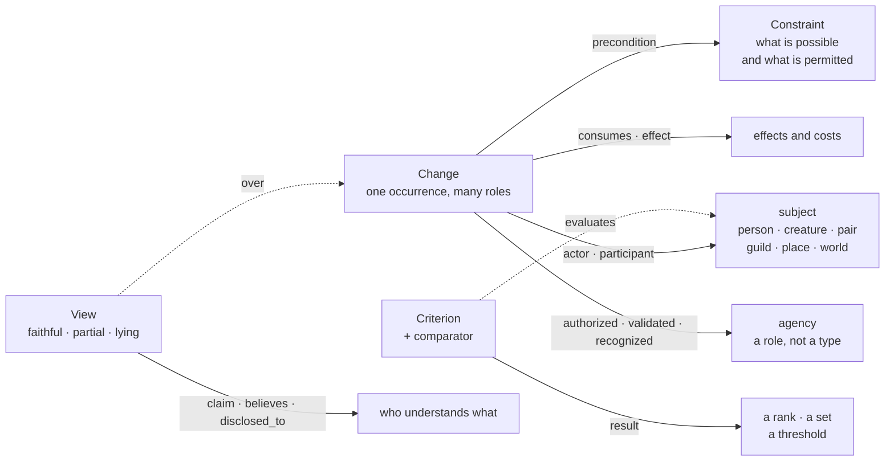

# The world model: capability, change, and progression

**Status: DESIGN, revised 2026-08-21.** Not built. Every claim marked ✅ was run against this
repository rather than reasoned about; every ❌ is a measured blocker with the check that
produced it.

**Revision.** This document was first written from the operator's direction alone. It has since
been checked against [`research/progression-generalization.md`](../research/progression-generalization.md),
which overturned six of its claims. The corrections are in §0.1 rather than quietly folded in,
because a design note that silently absorbs its own errors teaches the wrong lesson twice.

## 0. Where this came from

Operator direction, given while the Serial Pilot 1 seed was under review:

1. **Abilities and how they relate — to the world and to each other — matter more than
   HP/MP/Gold.** Readers are interested in unique abilities and interactions with the world.
2. **Ranks are the fun part**: Bronze, Silver, Gold … Diamond, applying to *abilities and
   creatures alike*, and **each rank has a different outfit** — a rank is something you can
   see, not just a value you are told.
3. **More than one system in the same world, with different logic.** Magic and body
   cultivation side by side. Or **no combat at all** — a world whose progression is crafting.
4. **Powers above the protagonist**: gods whose abilities match their aesthetic, unknown alien
   forces, the System itself, AI, spirits of nature.
5. **A system may accelerate real understanding.** One a book could have makes people learn
   real concepts faster — so as the protagonist develops, the book runs on actual ideas and
   actual discoveries rather than invented ones.
6. **Breakthroughs are earned at hurdles, and the hurdle is comprehension.** Advancement comes
   from understanding a concept deeply, and then more deeply again; a small number of
   load-bearing concepts can carry a whole serial by being reread rather than replaced.
7. **Immaterial things are characters.** A system usually has a personality — and so, when a
   book wants them, do the State, a magic, fate. They are registered as characters, not as
   scenery.
8. **The system is not the same in every book, and its personality is usually hidden.** Not
   obvious, not announced — a thing the book reveals rather than states, and only if that book
   wants it at all.
9. **Power lives in objects that change hands.** Collectible carriers — cards being the common
   shape — each holding a different power, usable by whoever holds one.
10. **Bonded companions.** Pairing with a creature whose *traits* are linked to the abilities
    the pairing grants; a unique bond, with abilities that act on the group together rather
    than on either partner.

**This is a palette, not a checklist.** It is what a world *could* have and how the pieces
would interact. No book needs all of it; a book may have one system, or none. The model must
make absence free — because the current model does the opposite. It has exactly one implicit
system, a LitRPG stat sheet, welded in at three constants and switched on by default.

*RS1 note.* Point 6 arrived with a published serial named as the reference. Per the pilot
package's own rule, no anchor work is named, quoted, or imitated in this document or in
anything generated from it: what is carried here is the mechanism in our own words, not the
book it was noticed in.

## 0.1 What the research changed

| this document said | what is true | why it matters |
|---|---|---|
| Predicate arity is **global**: `held_by`, `bonded_with`, `holds_rank` are functional. | Cardinality is **scoped** — predicate + scope + grouping key + validity interval + maximum, declared per world. | A workshop is jointly owned, shares are fractionally owned, a bond is unique in one world and plural in another. Global arity welds one world's physics into the engine: the stat sheet's mistake, one level down. |
| Hold a system's concealed personality in `pov_visibility`. | `pov_visibility` stays **operational packet access**. Belief and disclosure are first-class relations on claims. | Truth, belief, disclosure and packet-access are four things. Collapsed into one, "the reader knows and Silas does not" cannot be said at all. |
| Promote a page-minted subject on a **second mention**. | Separate **identity minting** from **factual promotion**; the strong evidence is later *causal reuse*, not repetition. | An ability the book uses again to do something has earned more than one merely named twice. |
| Systems, ladders, carriers, bonds and agencies are the primitives. | The primitives are **Change, Constraint, Criterion, View**. Everything else is vocabulary over them. | A palette of named fictional objects generalises badly — and reducing it is what finally makes absence free: there is nothing left to opt out of. |
| An agency authorises advancement (leaning on `authority`). | `StateAuthority` is **workflow** authority only. Story-world authority needs `authorized_by`, `validated_by`, `recognized_by`. | A guild recognising you and a policy decision accepting a revision are unrelated facts that happened to share a field. |
| `story_position` places a fact. | `story_position` records **occurrence**; validity needs `valid_during` / `supersedes`. | Possession has an interval. A carrier that changed hands at s7 was held *from* s3 *to* s7, and neither endpoint alone says so. |

What survived unchanged: the graph vocabulary already exists and is unused; the numeric
apparatus is one seed record away from off; the contradiction detector is backwards on edges;
nothing reads a non-stat fact off the page; and the sheet vocabulary is hardcoded.

## 1. What the store already gives us

✅ **The graph vocabulary exists and is unused.** `StateRecordKind` is `assertion | event |
relationship | knowledge | thread | world_rule | unknown`; `predicate` is a free-form string
nothing validates; **`object_ref` is an edge target** on every record. It survives the store
whole inside `record_json`, and `state.describe()` renders it into the **Established facts**
block of every draft packet.

✅ **Nothing writes an edge today.** Both golden fixtures hold **zero** records with
`object_ref` set; no code in `src/` constructs one. This is a documented capability whose only
caller is a test — which is why the direction above costs less than it looks like it should.

✅ **N-ary reification round-trips.** The research's worked encoding — a change with an actor,
a precondition, two costs and an effect, as five records sharing one subject — is accepted by
the contract unchanged. `record_id` is load-bearing here: claims and change occurrences have to
be referenceable, and they already are. **No migration is needed for the ontology.**

✅ **The graph is nearly free in the packet.** A 13-record ability graph assembled into a real
scene packet at **351 tokens of 16,000** — 2%.

✅ **`pov_visibility` filters packets, today.** `assemble` runs every record through
`state.visible_to()` and records an omission reason. Nothing in the draft path passes a POV, so
the rule is currently binary: empty is objective, non-empty reaches no scene. *Useful as an
access control — see §0.1 for what it must not be asked to mean.*

✅ **The numeric apparatus is one record away from off.** Drop the `status_snapshot` seed and
`speaks_system_voice` goes false, which switches off the stat-line instruction, the whole
progression schedule (`_milestones` is literally `if seed else []`), `progression_target`, and
the rules-pack warning in `status`. No code change. The code argues the point itself: *"a stat
block in a locked-room mystery is not a smaller error than a missing one."*

✅ **Almost everything downstream is already field-agnostic.** `impossible_fields` derives pairs
from the `_max` suffix rather than naming `hp`; `_milestones` takes its keys from whatever the
seed holds. Grepping `src/` for hardcoded `hp`/`mp`/`gold`/`level` outside `extraction.py`
returns two comments and no code.

## 2. What blocks it

❌ **The contradiction detector is backwards on edges.** `detect_contradictions` groups on
`(subject, predicate, order_key)` and counts *distinct values* — **`object_ref` is in neither
key.** Measured:

| what the book says | what it is | findings |
|---|---|---|
| `card_of_ashes held_by → silas` and `→ marta`, same position | one object in two hands | **0** |
| the same, but each edge carries a different note | the same impossibility | 1 |
| `ash trait → keen_scent` and `→ night_sight` | a creature with two traits | **1, MAJOR, blocking** |

A real contradiction is invisible, an ordinary fact is refused, and what decides which is
whether the prose happened to annotate the two edges differently.

**Correction, 2026-08-21, in place because the direction of the error is the informative part.**
Row 3 is wrong as written. Re-run against this repository — the four spellings are in
`tests/test_worlds.py::test_the_edge_cases_the_design_note_measured` — `ash trait → keen_scent`
beside `→ night_sight`, written as **edges with no value**, produced **0** findings, not 1. What
produced 1 was the same fact written with the trait in the `value` slot and no edge at all. This
note did not record which spelling it measured, and the two are not the same case.

The generalisation survives and gets stronger. The detector is not backwards on edges; it is
**blind** to them in both directions, and the thing it actually keys on is the annotation. So the
table's real shape is:

| spelling | findings, before the fix |
|---|--:|
| `held_by → silas` / `→ marta`, no value | 0 |
| the same, each edge annotated differently | 1, MAJOR, blocking |
| `trait → keen_scent` / `→ night_sight`, no value | 0 |
| `trait = keen_scent` / `= night_sight`, value only | 1, MAJOR, blocking |
| `held_by = silas` / `= marta`, value only | 1, MAJOR, blocking |

**Fixed 2026-08-21** by `plan/world-architect.md` §5 items 6: `object_ref` enters the grouping
key, so two edges are two facts here, and exclusivity moves to `state.cardinality.v0`, which
reads the world's own declared shape. Both changes are the pair — the key alone would make one
object in two hands permanently invisible. Both golden fixtures hold zero records with
`object_ref` set, so their silence is untouched by construction.

**The fix is a scoped cardinality shape, not a frozen arity table** (§0.1 row 1). A world
declares *this predicate, over subjects of this type, grouped by this key, across overlapping
validity, admits at most one* — and an undeclared predicate stays untyped and non-blocking.
Under open-world reading a missing value is unknown rather than false, so minimum counts are
unsafe until a scope is explicitly closed.

❌ **Reification is precise and prompt-illegible.** This is the blocker the research does not
name; it treats the packet as an access-control question and never asks what the generator
reads. Measured, the same fact in both forms:

```
appraisal cannot_read a person returns nothing; the System prices work, not life (living_things)
change-11 effect understood_by=elin (claim-11)
```

The flat graph reads almost like prose. The reified form is machine notation, and this
project's quality runs entirely through what the generator is handed. **Interpretation is
needed on the way out as well as the way in:** a projection that renders reified records back
into sentences before they reach the context packet. Without it, adopting the model makes canon
checkable and the prompt worse.

❌ **Nothing reads a non-stat fact off the page.** `extract_state` knows one line form,
`STATUS_PATTERN`. An ability, a rank, an edge or an agency the book invents never enters canon,
so the next scene is never told.

❌ **The sheet vocabulary is hardcoded.** `STATUS_PATTERN`, `STATUS_TEMPLATE` and
`STATUS_FIELDS` name Level/HP/MP/Gold literally, so "a minimal non-combat sheet" is a code
change — and so is any world whose numbers are different ones.

❌ **A new subject cannot enter from prose, by design.** `extract_state` skips any subject canon
does not already name. A graph that grows needs new nodes, so this needs a deliberate exception
(§6 item 1) rather than being quietly broken.

❌ **Four story-world roles have no home.** `authority` is workflow state and `story_position`
is occurrence; nothing expresses who *authorised*, who *validated*, who *recognised*, or over
what interval a fact was *valid*. Carriers and credentials both need all four.

## 3. The model

Four first-class patterns. Everything the operator direction names is **vocabulary over them**,
not a type of its own — which is what makes a world that declares none of it pay nothing.

**Capability is not a property; it is reachability.** What a subject can do is the set of
actions that are possible *and authorised* for it, against a target, in a context, under the
world as it currently stands. Progression is a narratively significant change in that set, in
what it costs, in how an authority evaluates it, or in who understands it — which admits upward,
downward, lateral, cyclical, transferred, collective, involuntary and misrepresented
progression without making any of them a special case.



**3.1 Change** is one occurrence with many roles, reified so a conjunction has a single
identity: actor, participants, preconditions, causes, what it consumed, what it effected. A
retirement that simultaneously removes a character, unlocks content and advances a shared
prosperity track is *one* change, and only reification says so.

**3.2 Constraint** is what is possible and what is permitted: prerequisites, exclusions,
gates, licences, and scoped cardinality. Prose makes it legible as a failed attempt, a
threshold, a prohibition, or an exception granted.

**3.3 Criterion** is how a subject is evaluated, and it carries a **comparator** — ordinal,
numeric, threshold, equality, strict set inclusion, Pareto/vector, or replacement-equivalence.
A rank is an *evaluation result under a criterion*, never an intrinsic property. Comparison is
partial by default: a system where specialising forecloses has no total order, and forcing one
would be the ladder assumption returning in disguise.

**3.4 View** is an interface over what is actually happening, and it may be faithful, partial,
or a lie. A game-like System that misrepresents the world is a view over another regime, not a
second causal engine. Belief and disclosure hang here: a claim is a node, `believes` and
`disclosed_to` are relations on it, and the gap between what is true, what a character holds,
and what the reader has been told is expressible rather than implied.

### 3.5 The vocabulary, and what each reduces to

| the direction says | it is |
|---|---|
| a system | a named bundle of rules, criteria, changes and views — analytic, and **not** necessarily a thing in the fiction |
| an ability | a named affordance, or a bundle of them |
| a tier ladder | an ordinal criterion domain, plus a presentation attached to each result |
| a depth ladder | successive claims, each non-entailed by the one before and each with consequences |
| a rank / an outfit | an evaluation result, and the evidence or presentation attached to it |
| a cost | an adverse effect of a change, under some criterion |
| a carrier | an entity whose possession changes an action's preconditions |
| a collection | set membership plus a completeness criterion |
| a bond | a composite subject whose capabilities need not be the union of its members' |
| an agency | an ordinary entity playing a role: causing, authorising, validating, recognising, narrating |
| a personality | optional state of such an entity, which may shape the rules or affordances it grants |
| a hidden personality | that state, plus a claim about it that has not been disclosed |

Two things follow that are worth stating plainly. **There is no character type in the contract
at all** — `CharacterSheet` is still deferred — so a subject is the only notion of a person the
system has, and fate, the State, a magic and the System are characters by default rather than
by extension. And **a book with no diegetic System is not a special case**: the analytic bundle
in §3.5 is our vocabulary for describing the book, and it never implies the world contains an
interface.

## 4. Progression has to have a checkable direction

The numeric machinery is not decoration; it exists because of a measured defect. §52 found 31
extracted status records across thirty scenes holding **two** distinct states — the ledger never
moved — and `_milestones` refuses a schedule where *"every milestone restates the starting
sheet; a schedule that schedules stasis"*.

That check must survive the generalisation, and it does — **per comparator, not per ladder**:

- *ordinal*: the result moved up the order, and `impossible_fields`' ceiling logic becomes "not
  past the top of the domain";
- *strict set inclusion*: the reachable set gained a member. This is the cabinetmaker case — the
  joiner goes from `[dry-stock dovetail]` to `[dry-stock dovetail, humid panel door, predict
  seasonal gap]`, with no number anywhere and a perfectly checkable direction of travel;
- *threshold*: a gate that was closed is open;
- *Pareto / vector*: something improved and the trade is named — the honest form for a system
  where specialising forecloses;
- *successive claims (depth)*: **rung N+1 must assert something rung N did not** and must have a
  consequence — a correct prediction, a newly reachable action, a foreclosed alternative.

The last is the weak one and should stay **advisory until its false-positive rate is measured**.
Deciding from prose alone that a claimed breakthrough is genuine new understanding rather than
paraphrase is exactly the judgment nothing here can yet make — and the failure it guards against
is the easiest thing in the world for a generator to produce: a character who visibly deepens
while the text says nothing it had not already said.

**A breakthrough is still a debt, and that ledger exists.** `PROMISE_KINDS` already carries
`progression`; `Promise` already carries `opened_at_key`, `due_key` and a payoff window;
`promise.overdue.v0` already fires on a debt that goes unpaid. The change that clears a hurdle
is the payoff of a progression promise — an advance with no promise behind it is unearned, and
an unpaid promise is a hurdle the book walked around.

## 5. Change surface

| # | change | where | note |
|---|---|---|---|
| 1 | **Scoped cardinality** replaces the value-only contradiction check: declared shapes over predicate + scope + grouping key + validity; undeclared stays untyped and non-blocking | `domain/integrity.py`, plus a constraint record pattern | the gate on everything else |
| 2 | **A projection layer** rendering reified records into sentences before they reach the packet | `domain/state.py::describe` / `domain/context.py` | the gate on the model being *usable*; §2 |
| 3 | Record patterns — not schema classes — for `change`, `constraint`, `criterion`, `view` | `domain/` | no migration; `record_json` already carries them |
| 4 | Separate the story-world roles: `caused_by`, `performed_by`, `authorized_by`, `validated_by`, `recognized_by` | vocabulary + `domain/integrity.py` | they must not collapse into one edge |
| 5 | Reserve `StateAuthority` for workflow and `pov_visibility` for packet access; add claims with `believes` / `disclosed_to` | `domain/state.py` | §0.1 rows 2 and 5 |
| 6 | Story-world validity: `valid_during`, `supersedes`, and an active-state projection distinct from manuscript retraction | `domain/state.py` | §0.1 row 6 |
| 7 | A small **comparator registry** — ordinal, numeric, threshold, equality, set inclusion, Pareto, replacement-equivalence | `domain/` | deliberately not a formula language |
| 8 | Derive the sheet from a per-book declaration, defaulting to today's six fields so both golden fixtures are untouched by construction | `domain/extraction.py` (3 constants → 1 derivation) | the round-trip test becomes a property over any declared sheet |
| 9 | A second extractor family: a line form for graph facts, its regex, and the same fill-and-parse-back test the status line has | `domain/extraction.py` | with §6 item 1: the promotion policy |
| 10 | Open a `progression` promise at a hurdle; pay it on the change that clears it | `application/summarize.py` — the ledger's only writer | the machinery exists |
| 11 | Ask the generator for the graph line, and show it the criterion it is writing against | `application/planner.py::render_prompt` | |
| 12 | The six-rule LitRPG pack speaks the stat vocabulary and lives in a sibling checkout | ContinuityEvaluation | flag; do not assume |

Items 1 and 2 are the pair to do first, and 2 is the one most likely to be skipped: a model that
is checkable and illegible to the writer trades this project's stated priority for its
instrumentation.

## 6. Open decisions

1. **What may the page mint, and what promotes it?** Identity minting and factual promotion
   should be separate: a new subject may be *named* by the page while its claims stay
   `PROPOSED`. Repetition is weak evidence and is rejected as a promotion rule; **later causal
   reuse** — the book using the thing again to do something — is the strong signal. The rule is
   still unwritten, and the trade is real: a proposed ability does not reach a packet, which is
   half the point of reading it back.
2. **How is a depth rung written down?** Short enough to sit in every later packet, specific
   enough to be checkably non-entailed by the rung beneath it. This is the format decision that
   decides whether the intellectual spine survives the context budget.
3. **Does the book get to be wrong?** If a concept is real, a deep reading can be false, and
   nothing checks that today. Whether a false claim about a real idea is a defect the system
   catches or a thing the operator reads for is a decision, not an oversight — and it is the
   first quality question in this project with an answer outside the text.
4. **Who declares cardinality shapes, and can a book add its own?** Free-form predicates are what
   make the graph cheap; cardinality is the first thing that constrains them. "Undeclared means
   unchecked" is the safe default and quietly leaves row 1 of §2 open for every predicate a world
   invents for itself.
5. **C2 contradicts points 7 and 8 as written.** The pilot's live constraint says *"The System is
   terse and neutral; it never advises, comments, or emotes."* A hidden personality and a terse
   surface are not the same claim: the interesting version is a System whose flat register **is**
   the concealment, which C2 could be rewritten to say.
6. **Reappraisal's own sheet, if it keeps one.** "Minimal non-combat" for a nine-day loop suggests
   `Day` and one resource — but the fiction is the operator's call, and C1, C4 and both chapter
   notes are written in the stat idiom today.

## 7. What this costs the pilot

Time loops are one of the research's falsification cases: *a single scalar story order cannot
distinguish local reset time, persistent meta-time, and incompatible prior cycles.*

Serial Pilot 1 is a time-loop serial. Its arc note ends chapter 2 on **an appraisal returning a
different value than it did in loop one** — a comparison across two cycles of the same morning,
which is precisely what a lexicographic `order_key` cannot hold. The eight scenes will draft
fine, and the reading copy will contain the hook. What canon will not be able to do is *know*
that the hook happened, so the one fact the serial's spine rests on is the one no detector can
verify.

That is a limit to record before the run rather than a reason to change it. The honest version
of the model refuses the inference rather than faking it: store what the book established, and
do not claim a cross-cycle comparison the store cannot make.
